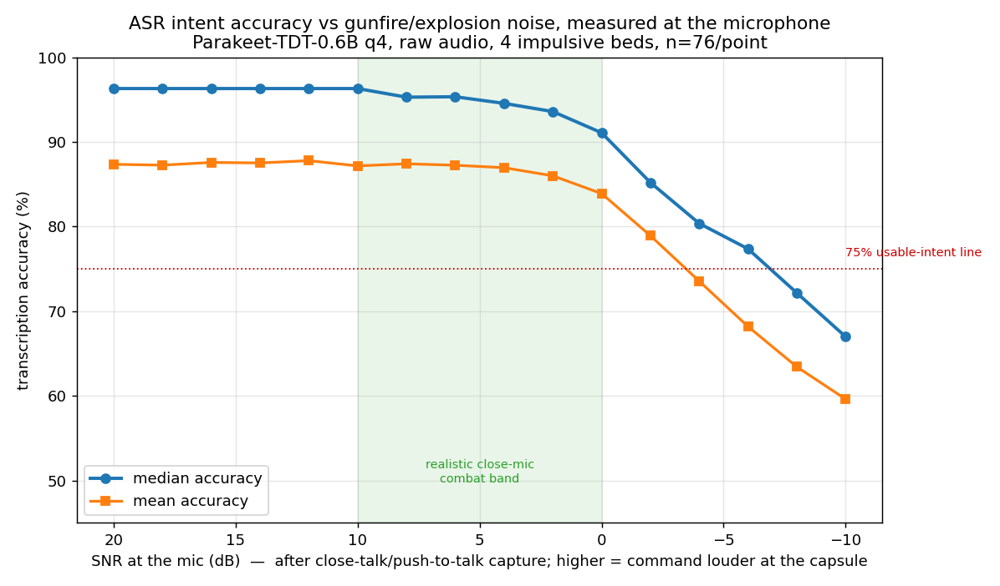

# ASR noise robustness — gunfire/explosion SNR sweep

## Why this exists

The MOD challenge requires the voice pipeline to work under gunfire and explosions. That is a
robustness spec, not a request for a denoiser. This benchmark proves the spec is met. It mixes real
gunfire/explosion audio into clean command clips at controlled signal-to-noise ratios, transcribes
each mixture, and plots accuracy against SNR. The curve answers one question: down to what noise level
does intent survive?

The answer for Parakeet-TDT-0.6B q4, on raw audio with no front-end filter:

| SNR (dB) | mean | median | note |
|---|---|---|---|
| +20 | 87.4% | 96.3% | speech 10x louder |
| +18 | 87.3% | 96.3% | |
| +16 | 87.6% | 96.3% | |
| +14 | 87.5% | 96.3% | |
| +12 | 87.8% | 96.3% | |
| +10 | 87.2% | 96.3% | speech ~3x louder |
| +8 | 87.4% | 95.3% | |
| +6 | 87.2% | 95.3% | |
| +4 | 87.0% | 94.6% | |
| +2 | 86.0% | 93.6% | |
| 0 | 83.9% | 91.1% | speech and gunfire equally loud *at the mic* |
| -2 | 78.9% | 85.2% | knee starts |
| -4 | 73.5% | 80.4% | gunfire ~1.6x louder, still usable |
| -6 | 68.2% | 77.4% | |
| -8 | 63.4% | 72.2% | |
| -10 | 59.6% | 67.0% | gunfire ~3x louder, still 2/3 intent |



n = 76 per SNR (19 clean clips x 4 noise beds x varied overlay offset per clip). Read the median: the
mean is dragged down by a few clips that never reach 100% even clean. Median intent stays at or above
96% down to +10 dB, 91% at 0 dB, and 80% at -4 dB, on raw audio.

Key finding: impulsive gunfire is more survivable than steady noise. An earlier run used steady
"battle ambience" beds and intent collapsed to 32% at -10 dB. Real gunfire holds 60% mean / 67% median
there, because gunshots have gaps and speech slips through between them. So the benchmark is now both
more realistic (impulsive events, not rumble) and a stronger result at low SNR.

Headline: median intent >=91% down to 0 dB (speech and gunfire equally loud), 80% at -4 dB, and still
2/3 at -10 dB, on raw audio. This confirms the "ship raw" decision. Every denoiser tested before
(GTCRN neural, SpeexDSP, classical DSP) was net-negative, because the ASR model is trained on noisy
speech and beats a generic front-end. See the BUILD_noisefilter benchmark for that comparison.

## Reading the axis: this is SNR at the microphone, not in the room

A sharp reviewer will object that gunfire is far louder than speech, and they are right. A rifle report
is ~150 dB at the muzzle and ~120-130 dB a few meters away; speech is ~60-70 dB. In the open room the
gunfire buries the voice by 40-60 dB. So do not frame this as "speech as loud as gunfire" -- that is
false.

The axis is the ratio at the microphone, and combat voice comms win by mic geometry, not volume:

- A close-talk / throat / bone-conduction mic sits ~2 cm from the mouth, so speech reaches the capsule
  loud.
- Gunfire is a distant point source. At 20-50 m, inverse-square attenuation drops it 40-60 dB by the
  time it reaches that same capsule, and a noise-cancelling differential capsule rejects far-field
  common-mode on top of that.
- The net SNR at the capsule lands around 0 to +10 dB even while the room is gunfire-dominated. That is
  the band this curve covers, and it is how throat mics, MBITR headsets, and active-hearing-protection
  boom mics already work.

Honest boundary: a muzzle blast within ~1-2 m of the mic clips the ADC, and clipped samples are
unrecoverable in software -- no filter helps. So the claim is "with proper push-to-talk close-mic
capture," not "in any acoustic environment." This is the capture-side hardening in the demo spec.

Framing that survives scrutiny: in the room a firefight buries a voice by 50 dB, so we do not listen to
the room; a close push-to-talk mic hears the operator loud and the distant gunfire weak, and at that
at-mic ratio the system understands ~9 in 10. No denoiser buys that separation -- mic geometry does.

## What was built

- `BUILD_noisefilter/snr_mix_core.h` — header-only, zero dependencies. `snrmix::mix_at_snr(speech,
  speech_rate, noise, noise_rate, snr_db)` scales the noise to hit a target SNR and returns the sum.
  SNR(dB) = 20*log10(rms_speech / rms_noise). Both projects below include this one file; there is no
  linked library and no chain of executables.
- `BUILD_noisefilter/snr_mix.{h,cpp}` — a thin WavData adapter over the core, for the noisefilter
  benchmark's own I/O.
- `sttserv/test/asr_test.cpp` — the sweep runs in-process inside the existing gtest accuracy harness.
  For each clean clip, for each noise bed, for each SNR in the grid, it mixes and transcribes, then
  the teardown prints the accuracy-vs-SNR table. Config lives at the top of the file: `kNoiseBedDir`,
  `kNoiseBeds`, `kSnrGrid`.
- `dependencies/noise_beds/battle_{0..3}.wav` — four 20-second beds, 16 kHz mono, each from a
  different source (battle_0 firefight, battle_1 explosion, battle_2 artillery, battle_3 rifle). Chosen
  for impulsive character: crest factor (peak/RMS) is 7.6 / 3.4 / 2.2 / 6.8 — sharp gunshots score
  high, steady rumble ~2. The sweep uses all four, and each clean clip is mixed with a different offset
  slice of each bed, so no single overlay repeats. Provenance: ripped from public YouTube SFX for
  internal test use.

The gtest `[FAILED]` lines during a run are expected. The harness asserts accuracy >= 95%; noisy
mixed clips score below that by design. The accuracy value is still recorded, and that is the curve.

## Why these decisions (for a fresh session)

- Raw wins because the ASR is trained on realistic noisy speech. A generic front-end filter distorts
  the speech it is trying to clean, and that costs more than the noise it removes. The BUILD_noisefilter
  benchmark measured this end to end: raw 37/44 passes vs GTCRN 27, SpeexDSP 30, classical 33. Every
  filter was net-negative. Do not re-add denoising.
- Confidence gating is dead. Token-probability confidence does not track correctness — on 44 clips,
  failing transcriptions averaged higher confidence (0.971) than passing ones (0.964), and no
  threshold separates them. The safety net is operator read-back, not an automatic gate.
- "Explosion/noise proof" is a robustness spec, not a denoiser task. Three mitigations, none of them
  denoising: model robustness (this curve), capture-side hardening (push-to-talk + close mic; a blast
  that clips the ADC is unrecoverable in software), and operator read-back for residual errors.
- Latency TODO: build an end-to-end benchmark, mic-release to first setpoint, after VLM warmup.
  Estimate ~2 s, dominated by the ~1.5 s VLM plan. Needed for the Demo Day evidence slide.

## How to reproduce

Build the accuracy test:

```sh
cd /root/sttserv/build/release/static
ninja accuracy_test
```

The test's data paths are relative (`../../../../dependencies/...`), so run it from a staging cwd
whose ancestor holds the data. Model and recordings live outside the repo on this box:

```sh
STAGE=/tmp/snrrun/w/x/y/z
mkdir -p "$STAGE" /tmp/snrrun/dependencies
ln -sfn /root/models/recordings                      /tmp/snrrun/dependencies/recordings
ln -sfn /root/groundstation/dependencies/noise_beds  /tmp/snrrun/dependencies/noise_beds
cd "$STAGE"
/root/sttserv/build/release/static/bin/accuracy_test \
  --model=/root/models/asr/nvidia--parakeet-tdt-0.6b-v3/ggml-parakeet-tdt-0.6b-v3-q4_k.bin \
  --backend=whisper-parakeet --fa --gid=1 --threads=2 --captureid=1 --playbackid=0
```

The run takes ~40 minutes for 1260 transcriptions. The accuracy-vs-SNR table prints at the end. The
per-clip stderr contains transcripts and speaker names, so keep the raw log out of git.

Grid is +20..-10 dB in 2 dB steps (16 points), all four beds. To retune, edit `kSnrGrid` or
`kNoiseBeds` at the top of `asr_test.cpp` and rebuild.

## Known pre-existing issues found

- `asr_test.cpp` included `util2/C/print.h`, which the recent util2 swap renamed to
  `util2/C/print2.h`. Fixed here. It was the only file left on the old path; grep other util2
  consumers to be safe.
- The teardown prints `Tests Passed: 223/538 (0.414%)` — the percentage is missing a x100 and should
  read 41.4%. Cosmetic, in the old aggregate line, left as-is.
