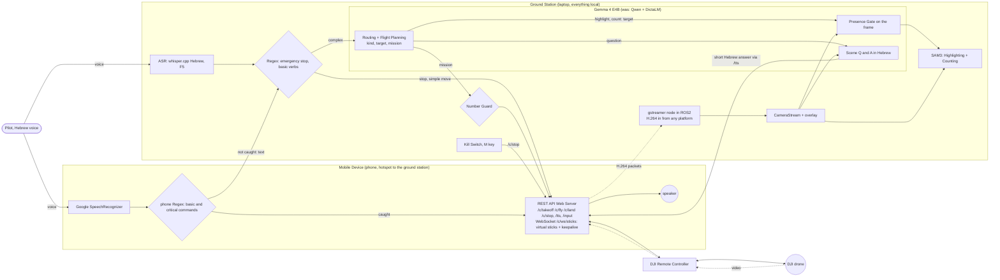
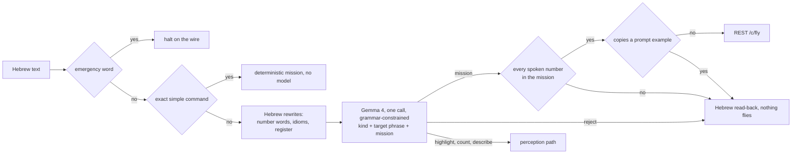
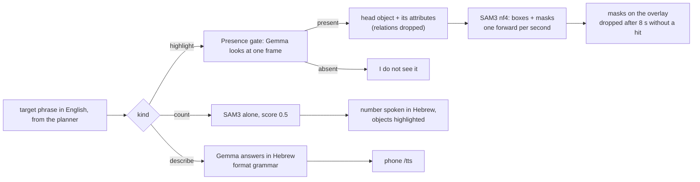
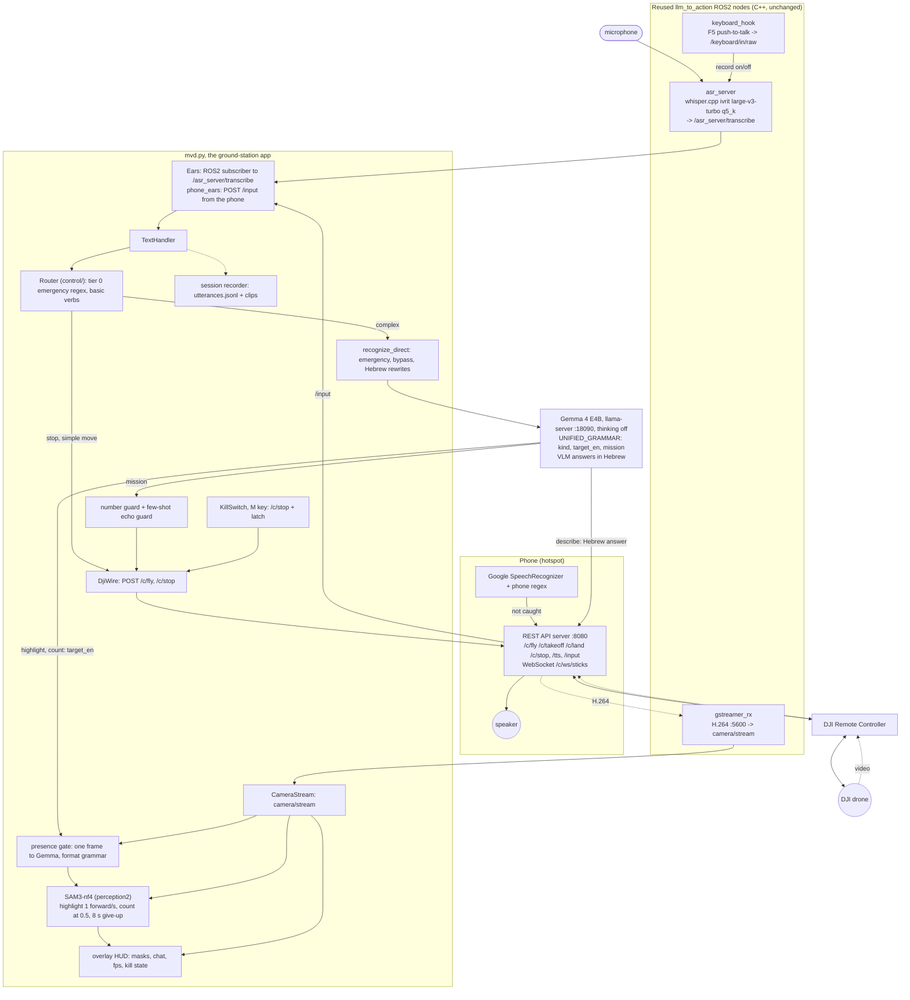

# integration_harden2 — the single-model Hebrew voice-drone stack (architecture, 2026-09-08)

One GPU model does the language work: Gemma 4 E4B reads the Hebrew, routes it, plans the mission, names the
object for the segmenter, looks at the frame, and answers in Hebrew. whisper does the ears, SAM3 does the eyes.
Solid boxes exist and ran live on 2026-09-08 (webcam + mock). Dashed boxes are not built.

**This is the LIVE system's architecture** (the repo's primary one). The frozen fallback is `integration_tts`; the parked C++ destination engine is `spec-fmu-architecture.md`.

## Simplified, demo-day style (same three lanes as the 2026-08 diagram)

Changes against the demo-day system, one per line:
- ASR: the phone's Google SpeechRecognizer stays as the first line: a regex on the phone handles basic and critical commands; what it does not catch comes to the ground station as text (/input). The laptop path is whisper.cpp Hebrew.
- Qwen -> Gemma 4. One model does routing, flight planning, the presence gate and the Hebrew scene answers.
- Scene Transcribing + Text Simplifier -> one box, Scene Q&A in Hebrew. No translation to English and back any more.
- Highlighting: OmDet + SAM2 -> SAM3, fed by the English target phrase the planner writes.
- New: Number Guard between the plan and the wire. New: Kill Switch on the M key, straight to /c/stop.
- The Regex stays as tier 0 (emergency words, basic verbs). Every command reaches the aircraft through the phone's REST API server, then the DJI Remote Controller; the same server speaks the TTS and forwards the H.264 video, which the gstreamer node in ROS2 turns into our frame source for any platform. The WebSocket /c/ws/sticks is the virtual-stick channel with its keepalive.
- Not in the picture because not built: target approach, SAM3 counting.

To put it into draw.io: Arrange -> Insert -> Advanced -> Mermaid, paste the block above.

## In depth, slide 3: the language path

## In depth, slide 4: the perception path

Slide sources (2026-09-09 01:30): graphviz DOT files `docs/active/assets/harden2-{simplified,language,perception,detailed}.dot`, rendered locally with `dot -Tpng` / `dot -Tsvg` at dpi 192 (the llm_to_action lane's recipe: styled nodes, semantic fills, rank rows, aspect near 1.7:1). The mermaid blocks in this document are the in-doc previews of the same content. The webcam desk path (`VIDEO=webcam WEBCAM_DEV=2`) is a test input only and is left out of every diagram on purpose.

## Detailed (every component, with the measured numbers below)

## What each box is measured at (2026-09-08)

| box | number | source |
|---|---|---|
| whisper q5_k | CER 8.4 % on 107 live clips; 0.29 s per clip | tools/bench/hebrew_asr/README.md |
| Gemma unified call, 488 bench | 415/466 without the military set (harden: 410) | tools/bench/hebrew-command-bench/results/2026-09-08-unified-gemma4.md |
| Gemma as planner alone, commands | 318/328, thinking off | results/2026-09-08-recognizer-gemma4-direct-nothink.json |
| Gemma gate + SAM3 highlight chain | 28/42 present objects hit (Qwen: 22/42) | tools/bench/whole-system/results/2026-09-08/vision-sam3-chain.md |
| Gemma counting | 2/26 exact | vlm-compare.md |
| Gemma as ASR | CER 35.8 % -> rejected, whisper stays | hebrew_asr/README.md |
| live end to end, webcam + mock | 42 PASS / 17 FAIL of 62 utterances | integration_harden2/sessions/…170015-rog/REPORT.md |
| VRAM, whole stack resident | ~6.5 GiB peak of 8.15 (owner-observed) | live session |

## Switches
MVD_PLANNER=gemma4|qwen3vl · MVD_TRANSLATOR=none|hymt2|dicta · SCENE_SEG=sam3|omdet · SCENE_BG=off|<yolo.pt> ·
VIDEO=webcam|dji|rtmp · WEBCAM_DEV=<n> · SCENE_TTS=phone|off · SCENE_TTS_LANG=he · SCENE_SAM3_PERIOD · SCENE_HL_GIVEUP.
Boot: `MVD_HOME=integration_harden2 VIDEO=webcam WEBCAM_DEV=2 SCENE_TTS=off bash tools/desk-test/up.sh`.

## integration_tts — the frozen fallback

`integration_tts` is the proven English MVD kept as the demo safety net; changes never land there.
Its stack is the pre-harden2 one: English ASR -> a 4-tier deterministic router -> {simple verbs -> DJI
REST | complex queries -> OmDet-Turbo + SAM2 + Qwen-VL perception}, with phone-side Android TextToSpeech
for voice-out. It shares the DJI wire (spec-dji-*) and the ground-station-as-brain model with harden2;
it differs by using the older multi-model perception stack and English instead of the single Gemma-4
Hebrew planner. Full detail: `projects/integration_tts/README.md`.
