# Groundstation architecture — judge review diagrams (2026-09-06)

One high-level cross-system view, then one low-level section per system.
Each section gives the control flow in prose, then the diagram, then its evidence.
Status marks: **CURRENT** = running and verified. **WIP** = built or in progress, not wired or not verified.
**FROZEN** = the proven Demo-Day fallback; never modified.
Every claim cites its witness (file:line) or its measurement. Estimates are labeled.

| # | Section | Status |
|---|---|---|
| 1 | High-level cross-system view | — |
| 2 | integration/* — the current MVD | CURRENT, FROZEN |
| 3b | integration_harden2 — the Gemma 4 single-model fork (links the 09-08 doc) | CURRENT on webcam + mock, NOT flown |
| 3 | integration_harden — the successor | CURRENT, desk-verified |
| 4 | The 4-tier router and the basic-verb dispatch | CURRENT |
| 5 | The Recognizer (stages 0–6) | CURRENT, measured |
| 6 | The perception engine | CURRENT |
| 7 | perception2 — the SAM3 backend | CURRENT, WIRED (default since 2026-09-08) |
| 8 | DJI ApiServer wire protocol + mock | CURRENT |
| 9 | Desk-test harness, step by step | CURRENT |
| 10 | C++ llm_to_action FMU | CURRENT |
| 11 | A2 live dashboard | CURRENT |
| 12 | WIP lanes | WIP |
| 13 | Resource budget and verification gates | — |

---

## 1. High-level cross-system view

Three systems, drawn as separate clusters with NO shared hubs. Exactly two dashed links cross
between them — the only relations that exist: the Python apps run three binaries that
llm_to_action builds, and the C++ DjiBackend speaks the same wire protocol (deferred, WIP).
Everything else lives inside the cluster that owns it. The Python lineage is now three forks:
the frozen MVD; `integration_harden`, which since 2026-09-08 runs two GPU models — Qwen3-VL-4B
:18090 for planning and vision, Hy-MT2-Q4 :18091 for Hebrew-to-English (`run_mvd.sh:35-40`;
DictaLM on CPU stays as the `MVD_TRANSLATOR=dicta` switch); and `integration_harden2`, which runs
ONE GPU model, Gemma 4 E4B :18090, for routing, planning, the presence gate and Hebrew answers
(section 3b). Both successors highlight with SAM3-nf4 by default (`SCENE_SEG=sam3`). The FMU
runs its own llama-server (SITL harness, :8080 — `sim_core.sh:169-173`, `llamaclient.hpp:21`).

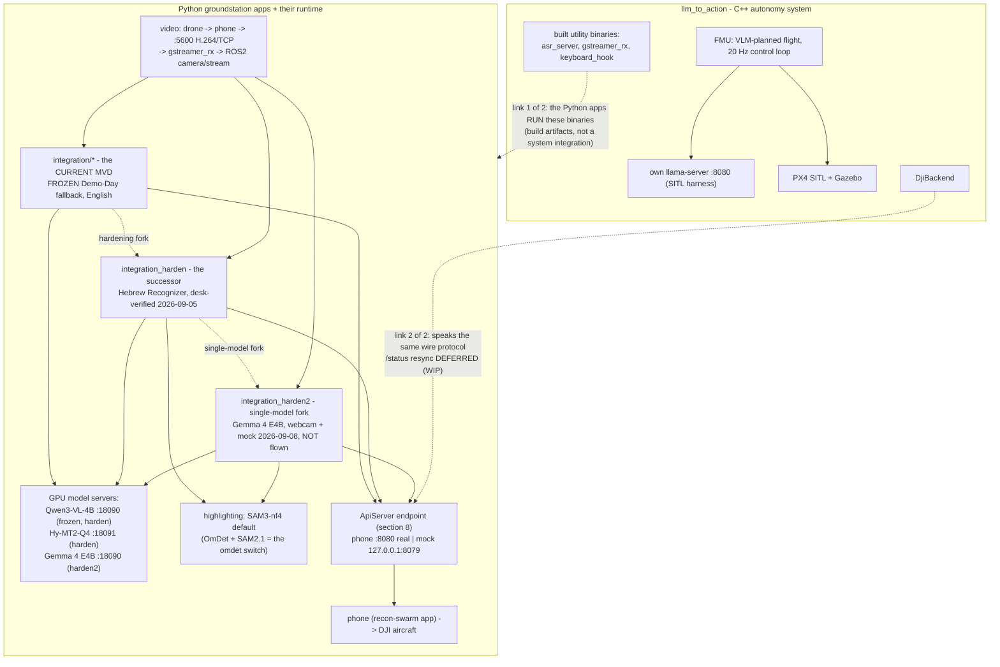
```mermaid
graph TD
    subgraph PY["Python groundstation apps + their runtime"]
        INT["integration/* - the CURRENT MVD<br/>FROZEN Demo-Day fallback, English"]
        IH["integration_harden - the successor<br/>Hebrew Recognizer, desk-verified 2026-09-05"]
        IH2["integration_harden2 - single-model fork<br/>Gemma 4 E4B, webcam + mock 2026-09-08, NOT flown"]
        INT -.->|"hardening fork"| IH
        IH -.->|"single-model fork"| IH2
        PYM["GPU model servers:<br/>Qwen3-VL-4B :18090 (frozen, harden)<br/>Hy-MT2-Q4 :18091 (harden)<br/>Gemma 4 E4B :18090 (harden2)"]
        SEG["highlighting: SAM3-nf4 default<br/>(OmDet + SAM2.1 = the omdet switch)"]
        EP1["ApiServer endpoint (section 8)<br/>phone :8080 real | mock 127.0.0.1:8079"]
        VID1["video: drone -> phone -> :5600 H.264/TCP<br/>-> gstreamer_rx -> ROS2 camera/stream"]
        PHD["phone (recon-swarm app) -> DJI aircraft"]
        INT --> PYM
        IH --> PYM
        IH2 --> PYM
        IH --> SEG
        IH2 --> SEG
        INT --> EP1
        IH --> EP1
        IH2 --> EP1
        EP1 --> PHD
        VID1 --> INT
        VID1 --> IH
        VID1 --> IH2
    end
    subgraph CPP["llm_to_action - C++ autonomy system"]
        FMU2["FMU: VLM-planned flight, 20 Hz control loop"]
        VLM8["own llama-server :8080 (SITL harness)"]
        SIM2["PX4 SITL + Gazebo"]
        UTIL["built utility binaries:<br/>asr_server, gstreamer_rx, keyboard_hook"]
        DB["DjiBackend"]
        FMU2 --> VLM8
        FMU2 --> SIM2
    end
    UTIL -.->|"link 1 of 2: the Python apps RUN these binaries<br/>(build artifacts, not a system integration)"| PY
    DB -.->|"link 2 of 2: speaks the same wire protocol<br/>/status resync DEFERRED (WIP)"| EP1
```

Also in the repo, out of this review's scope: `integration_notify/` and `integration_tts/`
(fork experiments; their wire clients were resynced with the rest on 2026-09-05), `projects/slam/`
(C++ headers `slam1/slam2/hover_hold_control`, no README, legacy status unknown), `archive/`.

---

## 2. integration/* — the current MVD — CURRENT, FROZEN

The proven Demo-Day system. English by design; Hebrew was never in its scope.

**Control flow.** The app is flat modules, not packages: `scene_omdet.py`, `router.py`,
`commands.py`, `dji_wire.py`, `ears.py` (ASR subscriber), `eyes.py` (detector), `camera_stream.py`.
A transcript arrives at the `on_text` closure (`scene_omdet.py:195`). With `MVD_DRONE=1` a
`Router(DjiWire.from_env())` exists (`scene_omdet.py:180`); `on_text` calls `router.handle(text)`
first. Tiers 1–3 (emergency, override/resume, basic verbs) act on the wire and the turn ends.
COMPLEX **falls through** to the perception dispatch in the same function — there is no
Recognizer here, so complex text is treated as a question, never a flight command (witness:
`scene_omdet.py:195-215` — non-COMPLEX tiers return; COMPLEX continues into `parse_highlight`). Without `MVD_DRONE`, the router
is never built and every utterance goes straight to perception.

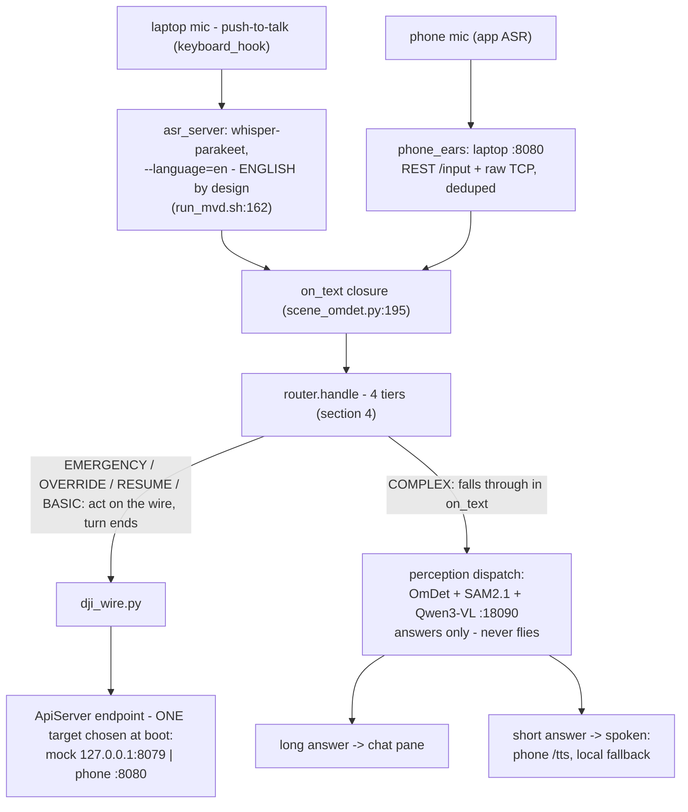
```mermaid
graph TD
    MIC["laptop mic - push-to-talk (keyboard_hook)"] --> ASR["asr_server: whisper-parakeet,<br/>--language=en - ENGLISH by design<br/>(run_mvd.sh:162)"]
    PH["phone mic (app ASR)"] --> PE["phone_ears: laptop :8080<br/>REST /input + raw TCP, deduped"]
    ASR --> OT["on_text closure (scene_omdet.py:195)"]
    PE --> OT
    OT --> R["router.handle - 4 tiers (section 4)"]
    R -->|"EMERGENCY / OVERRIDE / RESUME / BASIC: act on the wire, turn ends"| W["dji_wire.py"]
    R -->|"COMPLEX: falls through in on_text"| P["perception dispatch:<br/>OmDet + SAM2.1 + Qwen3-VL :18090<br/>answers only - never flies"]
    W --> EP["ApiServer endpoint - ONE target chosen at boot:<br/>mock 127.0.0.1:8079 | phone :8080"]
    P --> OUTL["long answer -> chat pane"]
    P --> OUTS["short answer -> spoken:<br/>phone /tts, local fallback"]
```

- No translation exists here, so no reject path exists. Reject is a successor-only outcome.
- A Hebrew transcript from the phone app falls through to COMPLEX like any unmatched text. Out of scope by design; the successor exists for Hebrew.

---

## 3. integration_harden — the successor — CURRENT, desk-verified 2026-09-05; defaults re-ruled 2026-09-08

The bootstrap of the MVD into the real Hebrew system. Desk-verified live: Hebrew mic ->
missions as HTTP 200 on the mock wire, real phone video, dataset recorded (2026-09-05 handoff §16);
two more mic sessions on 2026-09-08 (docs/active/2026-09-08-session-handoff.md §4.1).

**Defaults since 2026-09-08 (owner ruling):** translator = Hy-MT2-Q4 on the GPU (`run_mvd.sh:39`),
highlight backend = SAM3 (`scene_omdet.py:161`, section 7). DictaLM on the CPU and OmDet+SAM2.1 stay as
switches (`MVD_TRANSLATOR=dicta`, `SCENE_SEG=omdet`).

**Control flow.** One transcript, one pass through `TextHandler.__call__`
(`scene_omdet.py:270`): append to chat -> `_handle_drone` -> with a router present the router
**consumes every turn** — tiers 1–3 act on the wire and the action is echoed to chat; COMPLEX is
handled inside `router.handle` by the Recognizer `Pipeline` (`on_complex`). Only with no router
does `perceive()` run directly (the no-drone path). The Pipeline call is **synchronous on the ASR
callback thread** — translate + plan latency blocks `on_text` (known open item). Startup order
matters: the translator :18091 and Qwen :18090 must be up before the first COMPLEX utterance
(`run_mvd.sh` starts both panes). Every utterance is recorded by wrapping the REAL calls, not the handler: `main()` wraps
`wire.fly_mission`/`wire.halt` (the mission), `pipe._translate` (the English) and `pipe.handle`
(the action) into the SessionLog (`scene_omdet.py:457`), and the Recognizer traces each
utterance to JSONL (`pipeline.py:105`); the overlay renders the full chain per utterance:
`You / En / kind / Cmd List / -> action` (Hebrew RTL + English).
**Operator kill (2026-09-08):** the M key toggles `KillSwitch` (`scene_omdet.py:520`, `control/kill.py`):
POST /c/stop stops the aircraft and hands stick control back to the RC, then every motion verb is
refused (409) until M is pressed again. Tested with a fake wire only.

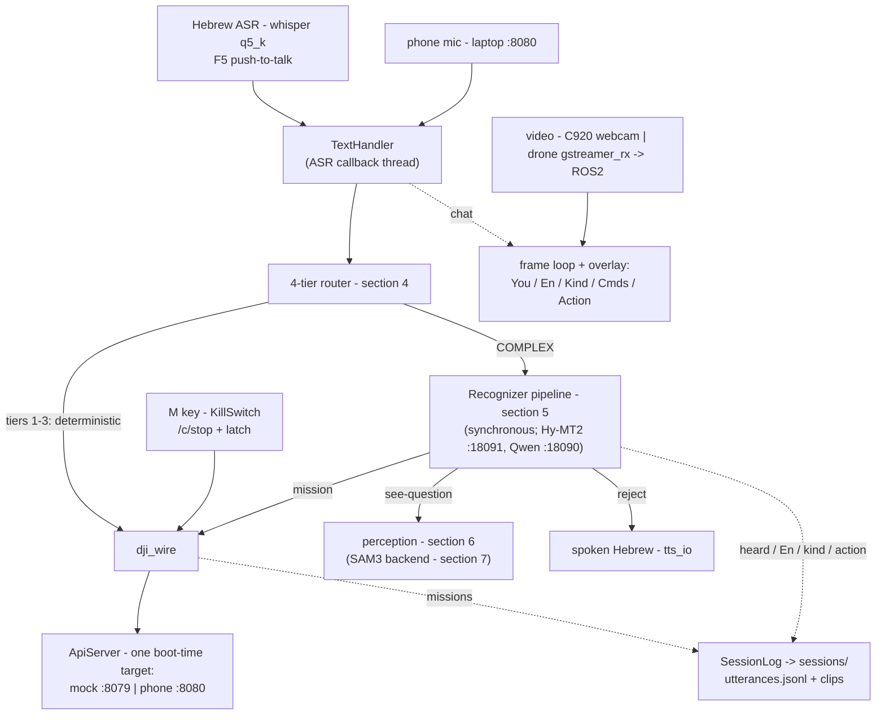
```mermaid
graph TD
    A["Hebrew ASR - whisper q5_k<br/>F5 push-to-talk"] --> T["TextHandler<br/>(ASR callback thread)"]
    P["phone mic - laptop :8080"] --> T
    T --> R["4-tier router - section 4"]
    R -->|"tiers 1-3: deterministic"| W["dji_wire"]
    R -->|"COMPLEX"| REC["Recognizer pipeline - section 5<br/>(synchronous; Hy-MT2 :18091, Qwen :18090)"]
    REC -->|"mission"| W
    REC -->|"see-question"| PER["perception - section 6<br/>(SAM3 backend - section 7)"]
    REC -->|"reject"| TTS["spoken Hebrew - tts_io"]
    K["M key - KillSwitch<br/>/c/stop + latch"] --> W
    W --> EP["ApiServer - one boot-time target:<br/>mock :8079 | phone :8080"]
    V["video - C920 webcam | drone gstreamer_rx -> ROS2"] --> UI["frame loop + overlay:<br/>You / En / Kind / Cmds / Action"]
    T -.->|"chat"| UI
    W -.->|"missions"| LOG["SessionLog -> sessions/<br/>utterances.jsonl + clips"]
    REC -.->|"heard / En / kind / action"| LOG
```

---

## 3b. integration_harden2 — the Gemma 4 single-model fork — CURRENT on webcam + mock (2026-09-08 20:00), NOT flown

A copy of section 3 (2026-09-08 17:20, owner ruling) with the language stack replaced by ONE model:
Gemma 4 E4B (QAT Q4_K_XL + vision projector, thinking off) on `:18090` reads the Hebrew directly,
routes it, plans the mission, names the object for SAM3 in English, looks at the frame, and answers
in Hebrew. No translator server runs (`MVD_TRANSLATOR=none`, `run_mvd.sh`; server flags in
`run_llama_server.sh`). The full picture, simplified (demo-day style) and detailed, with the measured
number behind every box, is **docs/active/2026-09-08-harden2-architecture.md** — this section only links it.

**Control flow.** The router (section 4) is unchanged. COMPLEX -> `Pipeline.handle_direct`
(`recognizer/pipeline.py`): `recognize_direct` runs stages 0-2 of section 5 (emergency, bypass, Hebrew
rewrites) and then ONE Gemma call under `UNIFIED_GRAMMAR` (`recognizer/prompts.py`) returns
`{kind, target_en, mission}`. kind=mission -> number guard (`numbers_vs_mission`: every spoken number
must appear in the mission) -> few-shot echo guard -> the wire. kind=highlight/count -> the English
target phrase goes to the presence gate (Gemma VLM with a format grammar) and then to SAM3.
kind=describe -> Gemma answers in Hebrew -> phone TTS (`SCENE_TTS_LANG=he`). kind=reject ->
Hebrew read-back. YOLO is off by default (`SCENE_BG=off`). Gemma's own boxes are never drawn
(median IoU 0.02); a highlight SAM3 cannot find for 8 s is dropped (`SCENE_HL_GIVEUP`).

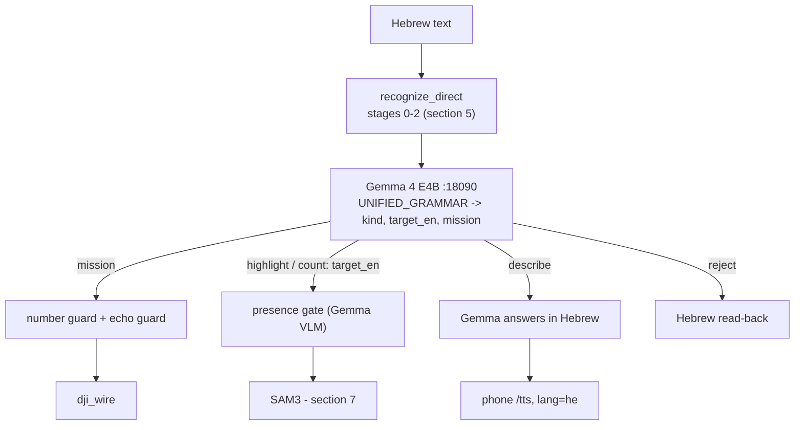
```mermaid
graph TD
    H["Hebrew text"] --> D["recognize_direct<br/>stages 0-2 (section 5)"]
    D --> G["Gemma 4 E4B :18090<br/>UNIFIED_GRAMMAR -> kind, target_en, mission"]
    G -->|"mission"| NG["number guard + echo guard"] --> W["dji_wire"]
    G -->|"highlight / count: target_en"| PG["presence gate (Gemma VLM)"] --> S3["SAM3 - section 7"]
    G -->|"describe"| QA["Gemma answers in Hebrew"] --> TTS["phone /tts, lang=he"]
    G -->|"reject"| RB["Hebrew read-back"]
```

Measured (2026-09-08): bench 488 through the unified call 415/466 without the military set (harden's
Hy-MT2 -> Qwen: 410/466; `tools/bench/hebrew-command-bench/results/2026-09-08-unified-gemma4.md`);
commands alone 318/328 with thinking off (314/328 with thinking on); live end to end on the C920 +
mock 42 PASS / 17 FAIL of 62 utterances, one unsafe event (a double negation flew two spins once;
`projects/integration_harden2/sessions/…170015-rog/REPORT.md`); peak VRAM ~6.5 GiB (owner-observed).
Not built: target approach, SAM3 counting. Not done: a real flight, the Hebrew TTS on the phone.
---

## 4. The 4-tier router and the basic-verb dispatch — CURRENT

Component: `control/router.py` over the `control/commands.py` grammar, called from
`TextHandler._handle_drone`. **Classification order is priority order**
(`commands.py:111-129`): emergency regex -> override -> resume -> the ordered verb table ->
bare movement intent ("go/move/head" with no direction) -> COMPLEX. Directional verbs are
matched before `land` on purpose, so "go down" is a move, not a landing.

**Where it lives: in BOTH MVDs, each with its own copy** (components are single-homed per fork).
This section documents the successor's `control/router.py` + `control/commands.py`. The frozen MVD
carries the ancestor copy (`integration/router.py` + `integration/commands.py`) with the same
4-tier shape; the one behavioural difference is COMPLEX — the successor hands it to the
Recognizer, the frozen MVD hands it to perception.

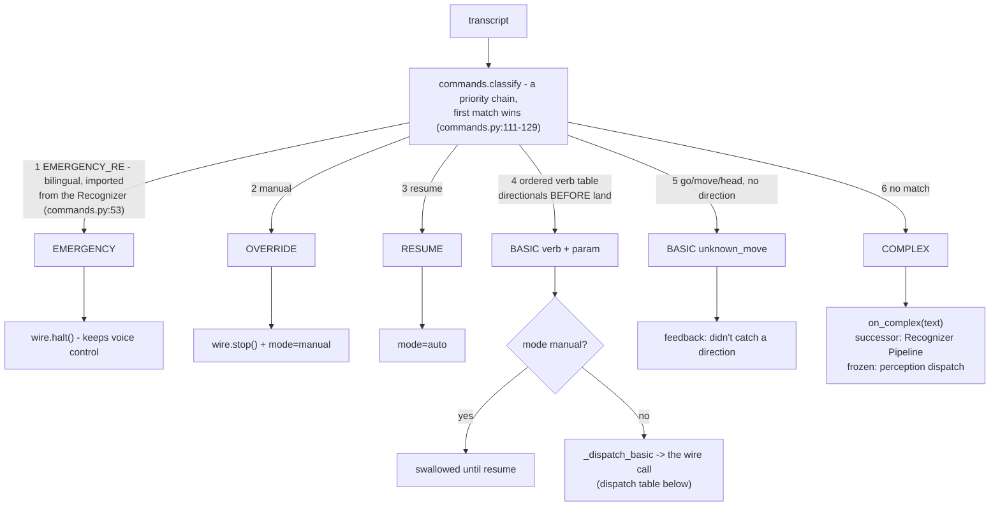
```mermaid
graph TD
    IN2["transcript"] --> CLS["commands.classify - a priority chain,<br/>first match wins (commands.py:111-129)"]
    CLS -->|"1 EMERGENCY_RE - bilingual, imported<br/>from the Recognizer (commands.py:53)"| TE["EMERGENCY"]
    CLS -->|"2 manual"| TO["OVERRIDE"]
    CLS -->|"3 resume"| TR["RESUME"]
    CLS -->|"4 ordered verb table<br/>directionals BEFORE land"| TB["BASIC verb + param"]
    CLS -->|"5 go/move/head, no direction"| TU["BASIC unknown_move"]
    CLS -->|"6 no match"| TC["COMPLEX"]
    TE --> A1["wire.halt() - keeps voice control"]
    TO --> A2["wire.stop() + mode=manual"]
    TR --> A3["mode=auto"]
    TB --> MG{"mode manual?"}
    MG -->|"yes"| IG["swallowed until resume"]
    MG -->|"no"| DP["_dispatch_basic -> the wire call<br/>(dispatch table below)"]
    TU --> FB2["feedback: didn't catch a direction"]
    TC --> OC["on_complex(text)<br/>successor: Recognizer Pipeline<br/>frozen: perception dispatch"]
```

| Tier | Trigger | Wire action | Mode effect | Witness |
|---|---|---|---|---|
| EMERGENCY | bilingual stop regex, single home in the Recognizer | `wire.halt()` = `POST /c/fly [{delay:0}]` — preempts motion, NOT `/c/stop` | none — the user keeps voice control | router.py:60-63 |
| OVERRIDE | "manual" | `POST /c/stop` — hand stick authority to the RC | mode=manual; voice verbs swallowed | router.py:65-68 |
| RESUME | "resume" | none | mode=auto; the next mission re-takes control | router.py:70-72 |
| BASIC | the verb table | dispatch below | ignored while mode=manual | router.py:74-84 |
| COMPLEX | everything else | none here — handed to `on_complex` | — | router.py:86-88 |

Basic-verb dispatch (`router.py:_dispatch_basic`, lines 90-121):

| Verb(s) | Wire call | What happens |
|---|---|---|
| takeoff | `POST /c/takeoff` | discrete takeoff |
| land | `POST /c/land` | discrete land |
| spin / rotate N | `spin_by(360 / N deg)` | native precise-angle turn |
| go forward/back/left/right/up/down | `fly_by(±1 m, 2 m/s)` | bounded relative move, body frame |
| scan / search | `scan_ground(facing OUT / IN)` | orbit, camera out / in |
| track / follow / come home | `track_me / follow_me / go_home_to_user` | phone-GPS missions |
| wave | gimbal bob | greeting |
| camera forward/down/up | `gimbal_pitch(0 / -60 / +30)` | gimbal only, no motion |
| movement with no direction | none | feedback: "didn't catch a direction" |

Defaults are a deliberate indoor envelope: 0.5 m/s, 45 deg/s, 1.5 s nudges (router.py:17-21;
indoor VPS refuses lateral/vertical — yaw and slow vertical are the reliable axes).

---

## 5. The Recognizer — CURRENT, measured (488-case bench, 2026-09-08)

Hebrew utterance in; exactly one of five kinds out; the kind IS the routing decision.
Single home `recognizer/`; the bench imports it in place (`MVD_HOME` picks harden or harden2).
Stage names are the code's own (`recognizer.py:8-14`). Stages 0-2 are shared with harden2's direct
path (section 3b); stages 3-6 are the translated path of harden.

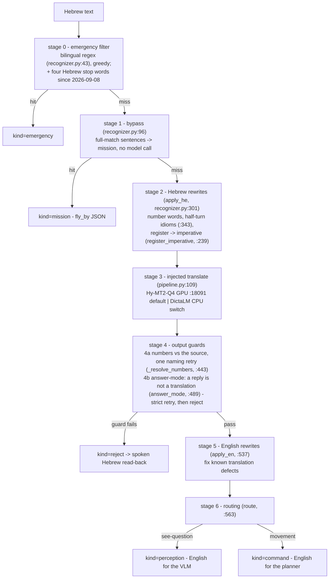
```mermaid
graph TD
    IN["Hebrew text"] --> S0["stage 0 - emergency filter<br/>bilingual regex (recognizer.py:43), greedy;<br/>+ four Hebrew stop words since 2026-09-08"]
    S0 -->|"hit"| EMG["kind=emergency"]
    S0 -->|"miss"| S1["stage 1 - bypass (recognizer.py:96)<br/>full-match sentences -> mission, no model call"]
    S1 -->|"hit"| MIS["kind=mission - fly_by JSON"]
    S1 -->|"miss"| S2["stage 2 - Hebrew rewrites (apply_he, recognizer.py:301)<br/>number words, half-turn idioms (:343),<br/>register -> imperative (register_imperative, :239)"]
    S2 --> S3["stage 3 - injected translate (pipeline.py:109)<br/>Hy-MT2-Q4 GPU :18091 default | DictaLM CPU switch"]
    S3 --> S4["stage 4 - output guards<br/>4a numbers vs the source, one naming retry (_resolve_numbers, :443)<br/>4b answer-mode: a reply is not a translation (answer_mode, :489) - strict retry, then reject"]
    S4 -->|"guard fails"| REJ["kind=reject -> spoken Hebrew read-back"]
    S4 -->|"pass"| S5["stage 5 - English rewrites (apply_en, :537)<br/>fix known translation defects"]
    S5 --> S6["stage 6 - routing (route, :563)"]
    S6 -->|"see-question"| PER["kind=perception - English for the VLM"]
    S6 -->|"movement"| CMD["kind=command - English for the planner"]
```

- The Qwen planner is NOT a stage. It runs in `pipeline.py:130` after `recognize()` returns
  kind=command, under a grammar-constrained verb whitelist with clamps. An empty plan is a
  refusal: no flight. A plan that copies one of the planner's own few-shot examples is rejected
  (`is_shot_echo`, `pipeline.py:94`). The LLM plans bounded verb arrays; it never streams sticks or velocity.
- An unknown kind never reaches the flight path (`pipeline.py:103`).
- Every 2026-09-08 guard change was gated on the bench with per-case flips against the same-code
  baseline: 0 unsafe flips (a wrong direction, a wrong sign, a negation that flies, a question that lands).

Measured 2026-09-08, the 488-case bench (temp 0; raw:
tools/bench/hebrew-command-bench/results/2026-09-08-recognizer-hymt2-488-gate.json; the 2026-09-03
370-case numbers are archived in results/HISTORY.md):

| Set | Hy-MT2-Q4 -> Qwen (deployed) | Note |
|---|---|---|
| emergency | 12/12 (100%) | greedy stage 0 |
| std190 | 247/253 (98%) | the four register phrasings won back by stage 2 |
| verbose | 51/63 (81%) | Hy-MT2 renders preambles literally |
| perception | 100/138 (72%) | keyword-group preservation of the translation |
| military | 10/21 (48%) | slang idioms, out of scope |
| ALL | 420/487 (86%) | DictaLM on the same cases: 346/412 before the 75 new cases |

Latency (tools/bench/hebrew-command-bench/README.md): std p50 130-190 ms, verbose p50 ~670 ms,
Recognizer + planner, depending on the translator.
---

## 6. The perception engine — CURRENT (SAM3 backend by default since 2026-09-08)

Components: `perception/engine.py` (pure logic, models injected) + `scene_omdet.py` (threads,
state, rendering). Entry: `TextHandler.perceive(english_text)` (`scene_omdet.py:300`) — reached from
the Recognizer (kind=perception, translated English; in harden2 the English target phrase written by
Gemma) or directly in the no-drone path. The detector and the mask function are injected callables
built by `build_highlight` (`scene_omdet.py:218`): SAM3 (section 7) when `SCENE_SEG=sam3` (the default,
`scene_omdet.py:161`), OmDet+SAM2.1 when `omdet`.

**Control flow, per utterance.**
1. `parse_highlight(text)` (`engine.py:28`) triages by regex: "clear/reset/never mind/stop following"
   -> the CLEAR branch; "highlight/find/where is/follow/focus on/emphasize X" -> the HIGHLIGHT
   branch with the phrase X (the last three verbs added 2026-09-08 — before that, follow/focus
   never reached the highlight path in any live run); anything else -> the ASK branch.
2. CLEAR: under the state lock, drop `S.target`, `S.vlm_box`, the masks; say "Cleared".
3. HIGHLIGHT (`scene_omdet.py:338`): snapshot the current frame under the lock, then spawn a
   daemon `_gate_thread` (`:355`) — the ASR callback thread never blocks on a model. The gate thread runs
   `engine.presence_gate(frame, phrase)` (`engine.py:121`): the VLM is asked whether the phrase
   is visible at all. Absent -> target cleared, chat: "I don't see a X in view." Present ->
   `S.target = phrase_concepts(phrase)` (`perception2/concept.py:145`, attribute-preserving), the VLM's
   own box is kept as `S.vlm_box` (harden only; harden2 drops it), chat: "Highlighting: X".
4. ASK (`scene_omdet.py:346`): snapshot the frame, spawn a daemon `_ask_thread` ->
   `vlm.ask(frame, question)`. The long answer is appended to chat; a distinct short answer is
   appended as "spoken" and voiced through `tts_io` (phone `/tts` by default).
5. CONTINUOUS TRACKING: highlight persistence is re-detection, not a tracker. The `worker`
   daemon loop (`scene_omdet.py:197`) copies the frame and state under the lock every few
   milliseconds; while `S.target` is set it calls `engine.highlight_step(...)` per iteration and
   writes surviving detections + masks back for the render loop to draw. With SAM3 the detect
   callable is rate-limited to ONE forward per `SCENE_SAM3_PERIOD` (1.0 s, `scene_omdet.py:162`)
   per phrase; in between it returns the cached detections.

**Inside `highlight_step`** (`engine.py:103`) — the gate order, each with its reason:

| # | Gate | What it does | Why it exists | Witness |
|---|---|---|---|---|
| 1 | presence gate (ran before tracking starts) | VLM: "is X visible?" | open-vocab detectors ground ABSENT phrases onto salient objects — a confident box for "red backpack" lands on a person; the VLM says whether X is there at all | engine.py:121; lane 3c: SAM3 alone 82/89 vs the gates (whole-system/results/2026-09-08/sam3-alone.md) |
| 2 | the detector at a low floor | SAM3 on the concept phrase (1 forward / s) — or OmDet when SEG=omdet | so gate 3 sees the full field, not a pre-thresholded one | scene_omdet.py:218 |
| 3 | relative-confidence gate | keep only detections within REL of the top score | a 0.48 box dies next to a 0.90; two real windows at 0.85/0.88 both live | engine.py header |
| 4 | masks | SAM3: masks come with the same forward (`mask_for_box`); omdet: SAM2.1 per surviving box | pixel-accurate highlight | perception2/sam3_backend.py; engine.py:79 |
| 5 | mask hygiene | drop whole-frame garbage masks; tighten each box to its mask; discard a near-full-frame box with no clean mask | SAM's failure mode is a frame-sized blob | engine.py:79-118 |
| 6 | VLM-box fallback | if the detector whiffed, the gate's own box goes through the SAME hygiene | Qwen's boxes are usable (median IoU 0.47); Gemma's are not (0.02) — harden2 disables this gate | engine.py:116 |

Live finding 2026-09-08 (harden2 on the C920): a compound phrase ("man with glasses talking to woman in
yellow shirt") scores 0.21-0.49 at SAM3 around the 0.30 keep floor, so the mask flickered once a second and
the VLM-box fallback drew a wrong rectangle in between. harden2 now cuts relational clauses before SAM3
(`_REL`, harden2 `perception2/concept.py:145`: -> "man with glasses"), never draws Gemma's box, and drops a
target nobody finds for `SCENE_HL_GIVEUP` = 8 s.

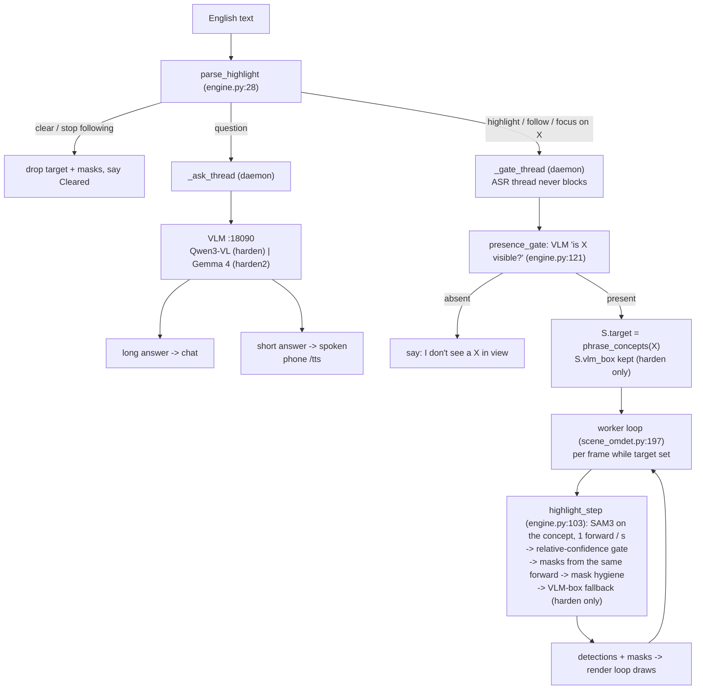
```mermaid
graph TD
    T["English text"] --> PH2["parse_highlight (engine.py:28)"]
    PH2 -->|"clear / stop following"| CLR["drop target + masks, say Cleared"]
    PH2 -->|"question"| ASKT["_ask_thread (daemon)"]
    PH2 -->|"highlight / follow / focus on X"| GT["_gate_thread (daemon)<br/>ASR thread never blocks"]
    ASKT --> VLMQ["VLM :18090<br/>Qwen3-VL (harden) | Gemma 4 (harden2)"]
    VLMQ --> LONG["long answer -> chat"]
    VLMQ --> SHORT["short answer -> spoken<br/>phone /tts"]
    GT --> PG["presence_gate: VLM 'is X visible?' (engine.py:121)"]
    PG -->|"absent"| NO["say: I don't see a X in view"]
    PG -->|"present"| SET["S.target = phrase_concepts(X)<br/>S.vlm_box kept (harden only)"]
    SET --> WK["worker loop (scene_omdet.py:197)<br/>per frame while target set"]
    WK --> HS["highlight_step (engine.py:103): SAM3 on the concept, 1 forward / s<br/>-> relative-confidence gate<br/>-> masks from the same forward -> mask hygiene<br/>-> VLM-box fallback (harden only)"]
    HS --> DRAW["detections + masks -> render loop draws"]
    DRAW --> WK
```
---

## 7. perception2 — the SAM3 backend — CURRENT, WIRED (SCENE_SEG=sam3 is the default since 2026-09-08)

Same public interface as `perception/`; one model instead of two (SAM3 detects AND masks in a
single forward). Wired on 2026-09-07 through the engine's injected `detect` / `mask_for_box`
callables: `build_highlight` (`scene_omdet.py:218`) returns `Sam3Backend.detect` (rate-limited, one
forward per `SCENE_SAM3_PERIOD`) and `Sam3Backend.mask_for_box` when `SCENE_SEG=sam3`. OmDet+SAM2.1
remain the `omdet` switch. Owner ruling 2026-09-08: SAM3 is the live default.

**Control flow (live path).**
1. `phrase_concepts(phrase)` (`concept.py:145`) — SAM3 grounds bare concepts, not instructions
   (fed an instruction it returns zero). The live path strips the leading article and KEEPS the
   attributes ("the red backpack" -> "red backpack"): SAM3 discriminates attribute phrases, and
   dropping the colour would highlight every car when the user asked for the white one. harden2 also
   cuts relational clauses ("… talking to …", "… next to …": harden2 `concept.py:145`, `_REL`).
   The older `extract_concepts` (`concept.py:124`, head-noun path + a VLM path) serves the offline chain demo.
2. `SYNONYMS` fan-out (`concept.py:21`): a bare category word expands to its class set — "vehicle" ->
   car, truck, motorcycle… — because SAM3's vocabulary does not generalize (a van is missed by
   both "car" and "vehicle").
3. One `Sam3Backend` forward (int4-nf4, 1,074 MiB in-process) returns boxes + masks + scores
   for every concept at once.
4. Results feed the same engine hygiene as `perception/` (section 6, gates 3-5).

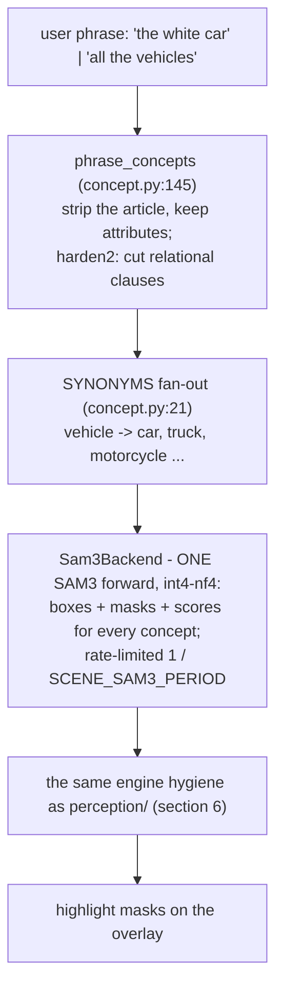
```mermaid
graph TD
    P0["user phrase: 'the white car' | 'all the vehicles'"] --> C1["phrase_concepts (concept.py:145)<br/>strip the article, keep attributes;<br/>harden2: cut relational clauses"]
    C1 --> EX["SYNONYMS fan-out (concept.py:21)<br/>vehicle -> car, truck, motorcycle ..."]
    EX --> S3B["Sam3Backend - ONE SAM3 forward, int4-nf4:<br/>boxes + masks + scores for every concept;<br/>rate-limited 1 / SCENE_SAM3_PERIOD"]
    S3B --> GATES["the same engine hygiene as perception/ (section 6)"]
    GATES --> OUT2["highlight masks on the overlay"]
```

Why the swap (measured, tools/bench/sam3-mask-bench/): nf4 995 MiB isolated / 1,074 MiB in-process vs
the OmDet+SAM2.1 pair at 1,591 MiB (863+728, census); 3.3x detections (332 vs 101 over 17 images);
masks on par (IoU 0.862); fp8+compile 202 ms forward (torch.compile is the lever, not the weight
format). On-demand only, never per-frame: one forward per second while a target is set.

**Status of the six items that were open on 2026-09-06:**
1. Wired: yes (2026-09-07), default since 2026-09-08. Live in the Step 3 mic session and the 2026-09-08 end-to-end run.
2. A/B against `perception/`: the whole-system lane 3 scores both VLM gates against SAM3 on 26 images
   (tools/bench/whole-system/results/2026-09-08/), the highlight chain lands 22/42 (Qwen) and 28/42 (Gemma)
   present objects, and lane 3c scores SAM3 alone at 82/89 against the gates' consensus. No human-labelled
   truth exists yet (22 asks are listed for a human eye in sam3-alone.md).
3. The swap point is exercised in the app every boot (`build_highlight`).
4. Cold start: nf4 eager, the app boots without it and highlights once "[scene_omdet] SAM3 ready" prints (~7 s after the weights); no torch.compile at boot.
5. GPU sequencing: one backend is chosen at boot; there is no runtime swap. Five models co-resident measured at 7,396 / 8,151 MiB (harden).
6. OPEN owner ruling unchanged: the presence gate suppresses plural/collective targets ("all the vehicles" -> present=False).
---

## 8. DJI ApiServer wire protocol + mock — CURRENT

The Kotlin recon-swarm app on the phone is the source of truth
(`/root/DJI-android-sdk-v5-recon-swarm/.../com/kcg/dr/api/server/ApiServer.kt`). The mock
(`tools/dji_mock/mock_apiserver.py`) mirrors it endpoint-for-endpoint, response shapes included
(resynced 2026-09-05), and logs every received command — timestamp, method, path, full JSON body —
to console + `MOCK_CMD_LOG` (`mock_apiserver.py:50-72`). Clients see ONE endpoint; which
implementation answers is a boot-time choice.

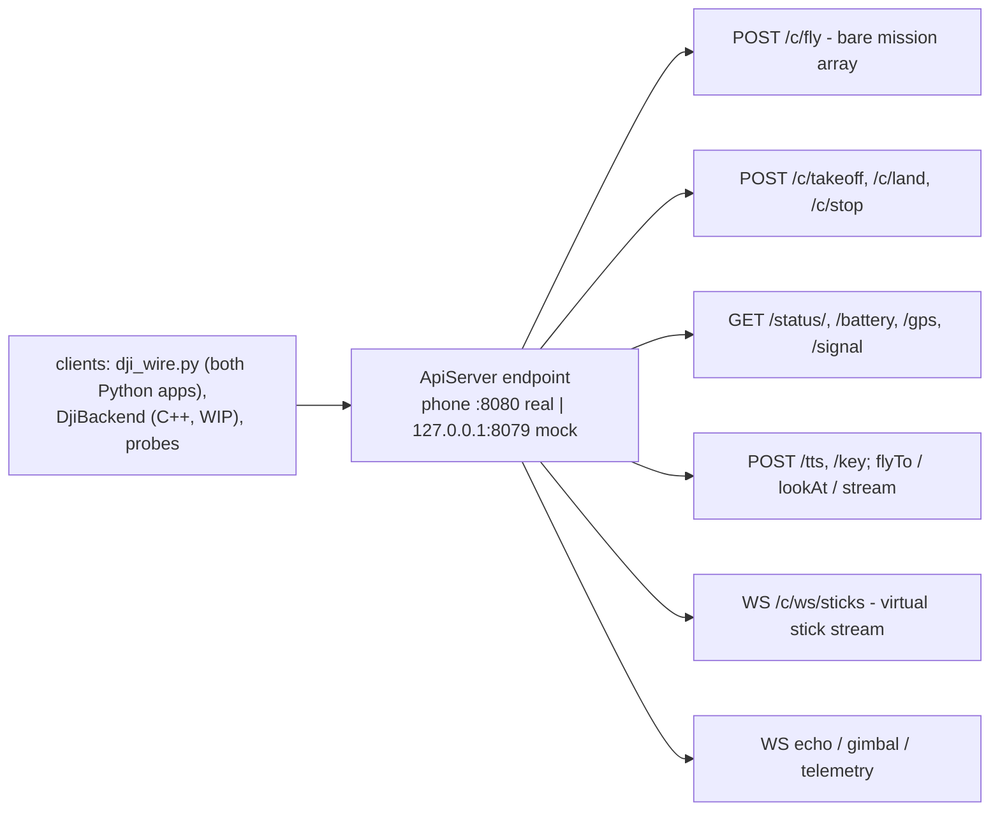
```mermaid
graph LR
    C["clients: dji_wire.py (both Python apps),<br/>DjiBackend (C++, WIP), probes"] --> S["ApiServer endpoint<br/>phone :8080 real | 127.0.0.1:8079 mock"]
    S --> R1["POST /c/fly - bare mission array"]
    S --> R2["POST /c/takeoff, /c/land, /c/stop"]
    S --> R3["GET /status/, /battery, /gps, /signal"]
    S --> R4["POST /tts, /key; flyTo / lookAt / stream"]
    S --> W1["WS /c/ws/sticks - virtual stick stream"]
    S --> W2["WS echo / gimbal / telemetry"]
```

Control-authority model (`dji_wire.py:70-105`): emergency `stop` keeps our authority
(`/c/fly [{delay:0}]` — a new mission preempts the running one); `manual` = `/c/stop` releases
authority to the RC; any new `fly{}` cancels the prior mission and re-takes control.

---

## 9. Desk-test harness, step by step — CURRENT

The owner runs everything; agents wrote the scripts (`tools/desk-test/`). Verified live 2026-09-05.
Each step below says what runs, what it does, and what appears where.

**Preconditions.** Phone on the hotspot with the API Server ON (video source; control stays on
the mock). Drone powered (streams video; the mock means nothing can fly). After a container
rebuild: `bash tools/devenv/install-runtime-deps.sh`.

**Step 1 — `bash /root/groundstation/tools/desk-test/up.sh`.** Creates the run directory
`/tmp/desk-test/<timestamp>/` and points the `latest` symlink at it. Phone IP is derived from
the WIRELESS default route only (a second wired route cannot poison it; `PHONE_IP=` overrides).

**Step 2 — preflight (inside up.sh; abort = nothing starts).** `preflight.sh` checks: the five
ports 18090/18091/8079/8080/5600 are free; the models exist (Hebrew ASR q5_k, Qwen3-VL-4B +
mmproj, the translator — Hy-MT2 Q4 by default, DictaLM as the switch — and SAM3 or SAM2.1 per
`SCENE_SEG`; preflight also refuses `hymt2` without `sam3`, because the old pair leaves no VRAM for a GPU translator); the three binaries exist; the phone answers `GET /status` on :8080
(HTTP, because the phone drops ping); `DISPLAY` is set. Every failure prints its fix and up.sh
stops: "preflight FAILED. Not booting."

**Step 3 — the mock.** `setsid python3 mock_apiserver.py 127.0.0.1 8079` with
`MOCK_CMD_LOG=<run>/mock_commands.log`. up.sh confirms the LISTEN on 8079 or aborts. From here
every REST command the app sends becomes one logged line with its full JSON.

**Step 4 — the dataset session.** `projects/integration_harden/sessions/session-<ts>-<host>/`
is created with `clips/`. Recording is ON by default (`DESK_TEST_RECORD=0` disables). The ASR
node writes one WAV per utterance into `clips/`; the app writes `utterances.jsonl` (heard
Hebrew, English, kind, action, mission). Audio never enters git.

**Step 5 — the app.** `run_mvd.sh` launches under a **detached pseudo-terminal**, because its
final `tmux attach` would block the shell and its EXIT trap would tear everything down.
`TMPDIR` points its logs into the run directory. The tmux session `mvd` comes up with panes:
`vlm` (Qwen3-VL :18090), `xlate` (the translator on :18091 — Hy-MT2 Q4 on the GPU by default,
`MVD_TRANSLATOR=dicta` for DictaLM on CPU; log `mvd_xlate.log`), `keys` (F5 hook), `asr` (whisper Hebrew
q5_k, `--record` into the session clips), `gst` (drone video :5600 -> ROS2), `dog` (video
watchdog), `app` (scene_omdet + overlay), and window 7 tails the mock's JSON live.

**Step 6 — readiness.** Wait for 18090 and 18091 to LISTEN; the first translator call is slower
than the rest (model warm-up) and is not an error. `bash status.sh` prints the compact picture: the five
ports with names, the tmux windows, and the last signal line from each log (router ON/DISABLED,
translator ready, gst frames, last ASR transcripts, last mock commands) — keyed to the test points.

**Step 7 — speak.** Hold F5, speak Hebrew, release. Expected per kind: a movement command shows
`You / En / kind / Cmd List / -> action` on the overlay and a `POST /c/fly` line with the full
mission JSON in window 7 and `mock_commands.log`, HTTP 200; a see-question shows a VLM answer
and no wire line; `עצור` shows `/c/fly [{delay:0}]`; a guard failure is spoken back in Hebrew.
Warm ASR is ~300 ms per utterance; the first is ~3.9 s (Vulkan shader compile).

**Step 8 — review.** `python3 show_session.py latest` prints the per-utterance table from
`utterances.jsonl` — what was heard, the English, the kind, the action, the mission.

**Step 9 — teardown.** `bash down.sh`: kills the named processes, then each tmux pane's whole
process group (catches double-forked llama-server/gst), kills the session, force-frees all five
ports, and prints "remaining listeners: none" as proof.

| Artifact | Where | Content |
|---|---|---|
| mock_commands.log | run dir | every REST command, full JSON |
| mock.log, mvd_app.log, mvd_xlate.log, asr.log, gst.log, dog.log | run dir | one log per component |
| utterances.jsonl + clips/*.wav | session dir | the recorded dataset, per utterance |

The same nine steps as a flow, with the artifacts they produce:

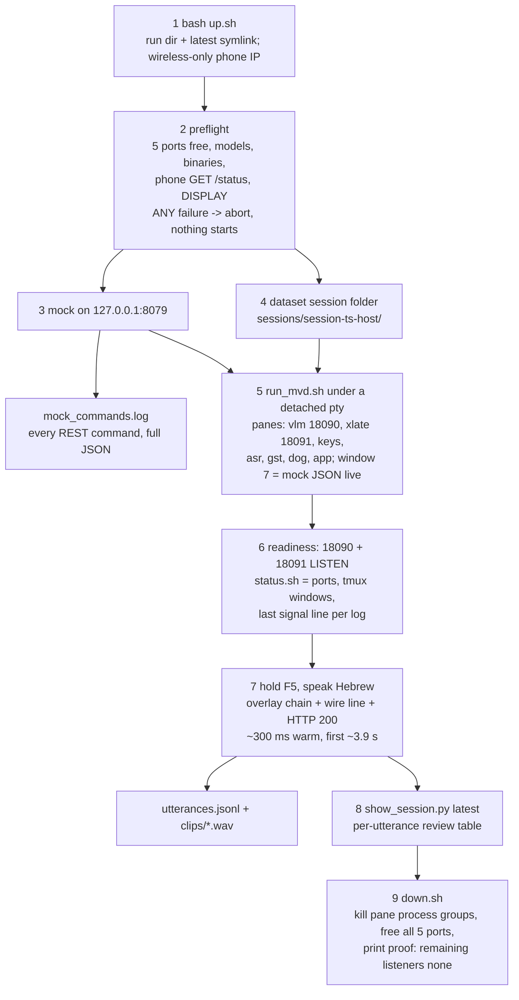
```mermaid
graph TD
    ST1["1 bash up.sh<br/>run dir + latest symlink; wireless-only phone IP"] --> ST2["2 preflight<br/>5 ports free, models, binaries,<br/>phone GET /status, DISPLAY<br/>ANY failure -> abort, nothing starts"]
    ST2 --> ST3["3 mock on 127.0.0.1:8079"]
    ST3 --> AR1["mock_commands.log<br/>every REST command, full JSON"]
    ST2 --> ST4["4 dataset session folder<br/>sessions/session-ts-host/"]
    ST3 --> ST5["5 run_mvd.sh under a detached pty<br/>panes: vlm 18090, xlate 18091, keys,<br/>asr, gst, dog, app; window 7 = mock JSON live"]
    ST4 --> ST5
    ST5 --> ST6["6 readiness: 18090 + 18091 LISTEN<br/>status.sh = ports, tmux windows,<br/>last signal line per log"]
    ST6 --> ST7["7 hold F5, speak Hebrew<br/>overlay chain + wire line + HTTP 200<br/>~300 ms warm, first ~3.9 s"]
    ST7 --> AR2["utterances.jsonl + clips/*.wav"]
    ST7 --> ST8["8 show_session.py latest<br/>per-utterance review table"]
    ST8 --> ST9["9 down.sh<br/>kill pane process groups, free all 5 ports,<br/>print proof: remaining listeners none"]
```

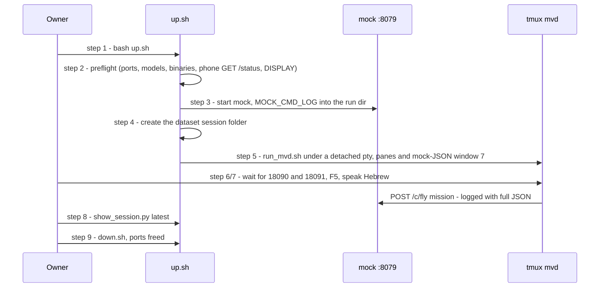
```mermaid
sequenceDiagram
    participant O as Owner
    participant U as up.sh
    participant M as mock :8079
    participant A as tmux mvd
    O->>U: step 1 - bash up.sh
    U->>U: step 2 - preflight (ports, models, binaries, phone GET /status, DISPLAY)
    U->>M: step 3 - start mock, MOCK_CMD_LOG into the run dir
    U->>U: step 4 - create the dataset session folder
    U->>A: step 5 - run_mvd.sh under a detached pty, panes and mock-JSON window 7
    O->>A: step 6/7 - wait for 18090 and 18091, F5, speak Hebrew
    A->>M: POST /c/fly mission - logged with full JSON
    O->>U: step 8 - show_session.py latest
    O->>U: step 9 - down.sh, ports freed
```

---

## 10. C++ llm_to_action FMU — CURRENT (the destination system)

VLM-planned autonomous flight: 12,084 lines of C++ ROS2, SITL-verified in Gazebo. The same
binary targets real hardware through swappable backends. One overview, then four follow-on
diagrams (10.1–10.4), each with its mechanism in prose. Every claim is witnessed in
`fmu_node.hpp` / `perception_runtime.hpp` / the backend sources.

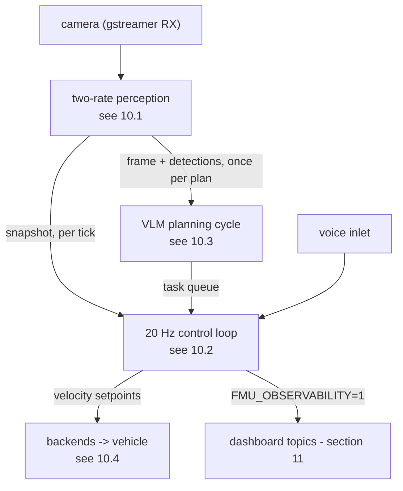
```mermaid
graph TD
    CAM0["camera (gstreamer RX)"] --> P0["two-rate perception<br/>see 10.1"]
    P0 -->|"snapshot, per tick"| L0["20 Hz control loop<br/>see 10.2"]
    P0 -->|"frame + detections, once per plan"| PL0["VLM planning cycle<br/>see 10.3"]
    PL0 -->|"task queue"| L0
    V0["voice inlet"] --> L0
    L0 -->|"velocity setpoints"| B0["backends -> vehicle<br/>see 10.4"]
    L0 -->|"FMU_OBSERVABILITY=1"| O0["dashboard topics - section 11"]
```

Deterministic-first: the VLM plans; the 20 Hz loop owns completion and the state machine.
ENU everywhere; NED only on the PX4 wire.

### 10.1 Two-rate perception

A single `frameSource` (the gstreamer RX frame) feeds BOTH engines
(`perception_runtime.hpp:50-56`). YOLO-seg runs on a 33 ms period (~30 Hz target, measured as
met); monocular depth (yolo26n-depth) runs on an 80 ms period (measured ~75 ms/frame in the FMU;
44 ms p50 standalone CPU-2t in the bench) — `fmu_node_base.hpp:87-88`. Two independently-paced
threads ON PURPOSE: one fused call would force seg to wait on depth every cycle. Accepted cost:
a bbox's `median_depth_cm` can lag one depth cycle. The snapshot has two consumers with
different jobs — the planner reads it once per plan; the control loop reads it per tick ONLY in
the vision-anchored laws (`m_perception->snapshot()` at fmu_node.hpp:789, 1144, 1308). GO
computes distance from the pose delta on a line frozen at activation — no vision term
(fmu_node.hpp:~839-885).

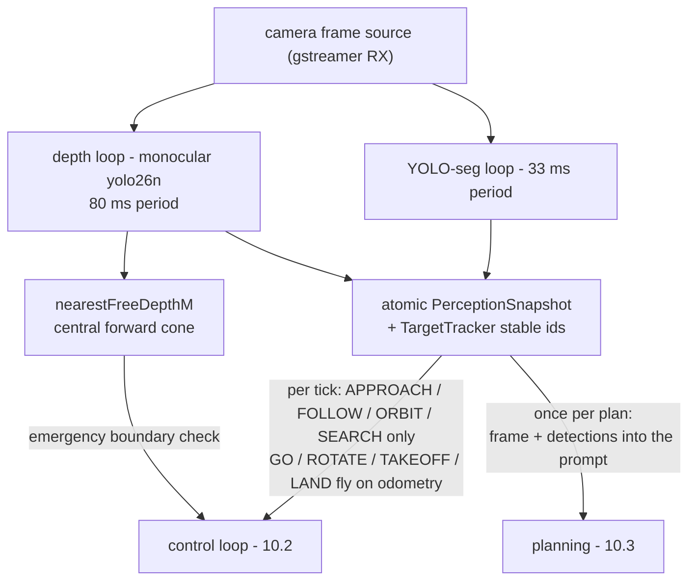
```mermaid
graph TD
    CAMIN["camera frame source (gstreamer RX)"] --> YO["YOLO-seg loop - 33 ms period"]
    CAMIN --> DE["depth loop - monocular yolo26n<br/>80 ms period"]
    YO --> SNAP["atomic PerceptionSnapshot<br/>+ TargetTracker stable ids"]
    DE --> SNAP
    DE --> FREE["nearestFreeDepthM<br/>central forward cone"]
    SNAP -->|"per tick: APPROACH / FOLLOW / ORBIT / SEARCH only<br/>GO / ROTATE / TAKEOFF / LAND fly on odometry"| C1["control loop - 10.2"]
    SNAP -->|"once per plan:<br/>frame + detections into the prompt"| V1["planning - 10.3"]
    FREE -->|"emergency boundary check"| C1
```

### 10.2 The 20 Hz tick

Tick order as coded (`controlLoop`, fmu_node.hpp:591):
1. `batteryFailsafeTick()` — the supervisor runs FIRST and can preempt everything (battery
   return/land overrides the VLM).
2. The voice inlet drain (`handleAsrCommand`, fmu_node.hpp:405): "land / abort / mayday" ->
   deterministic emergency land, VLM bypassed; "stop / halt / hold" -> deterministic hover;
   non-emergency while grounded -> `start(text)` launches the mission with the spoken objective;
   non-emergency while airborne -> a `user_command` interrupt (10.3).
3. Manual override: if the RC has control (and no battery action), the loop yields.
4. Throttled observability publishes (HUD, rates) — only under `FMU_OBSERVABILITY=1`.
5. Test rigs (flood / forced battery / synthetic obstacle) — armed only by test scenarios.
6. The state machine: TAKEOFF streams a climb velocity until odometry reaches target altitude
   (-> FLIGHT); LANDING streams a flared descent to touchdown (-> STANDBY); FLIGHT with a
   non-flying backend zeroes velocity and drops to STANDBY.
7. The emergency boundary, in FLIGHT (fmu_node.hpp:786-833). Trigger one: the nearest tracked
   detection is closer than a velocity-scaled threshold (freshness-gated; `nearestFreeDepthM`
   is read in the same check). Trigger two, the depth-INDEPENDENT backstop: a detection fills
   the frame past `kBoundaryLoomFillFrac` — close range is where depth over-reads, and that
   regime once let the drone drive into a car (the code says so). Either trigger ->
   `raiseInterrupt(emergency_boundary)` (10.3).
8. FLIGHT with an active task: step that task's law -> `m_backend->set_velocity(velEnu, yawRate)`
   -> check its completion predicate -> on completion, record to history and dequeue the next.
9. Queue empty: hover (zero setpoint) and call `maybePlan()` (10.3). The next tick starts at 1.

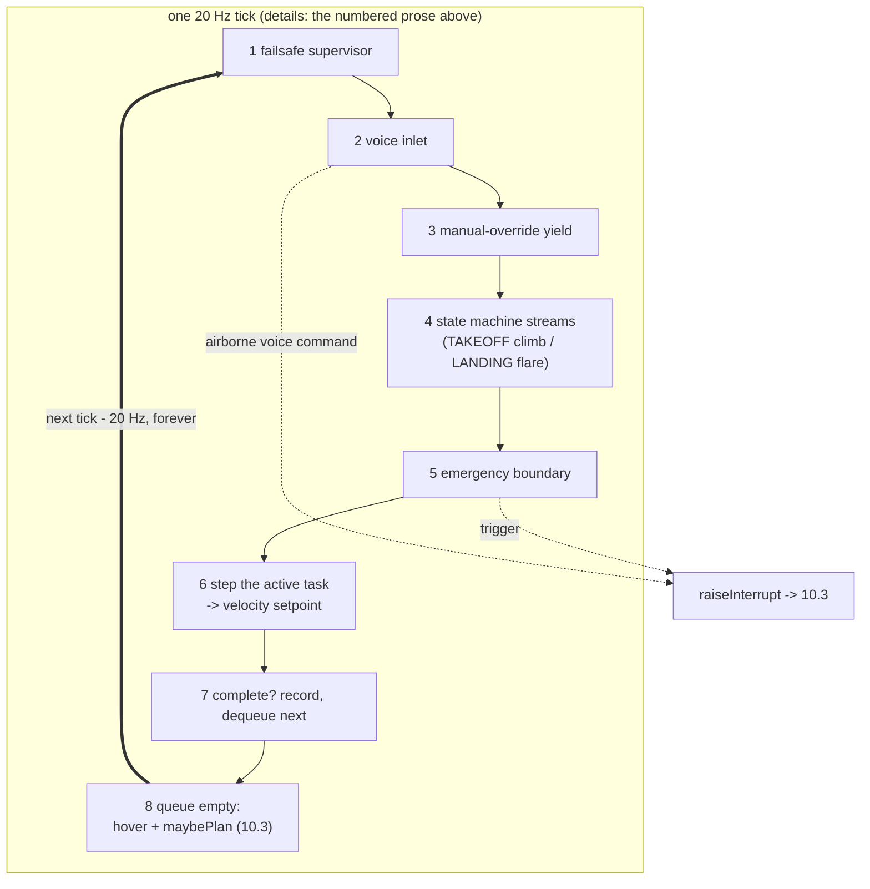
```mermaid
graph TD
    subgraph TICK["one 20 Hz tick (details: the numbered prose above)"]
        T1["1 failsafe supervisor"] --> T2["2 voice inlet"]
        T2 --> T3["3 manual-override yield"]
        T3 --> T4["4 state machine streams<br/>(TAKEOFF climb / LANDING flare)"]
        T4 --> T5["5 emergency boundary"]
        T5 --> T6["6 step the active task<br/>-> velocity setpoint"]
        T6 --> T7["7 complete? record, dequeue next"]
        T7 --> T8["8 queue empty:<br/>hover + maybePlan (10.3)"]
    end
    T8 ==>|"next tick - 20 Hz, forever"| T1
    T5 -.->|"trigger"| INT["raiseInterrupt -> 10.3"]
    T2 -.->|"airborne voice command"| INT
```

### 10.3 The planning cycle and interrupts

**When the VLM plans** (`maybePlan`, fmu_node.hpp:1496): only when mission active AND queue
empty AND not already planning AND a cooldown passed — then two warmups guard the FIRST plan
(wait briefly for the first camera frame, and for the first detection, so the VLM does not
"search" for a target that is merely not detected yet). Inference runs off-thread via
`std::async` under the single-flight `m_planning` guard; that async task is the queue's ONLY
producer, so the SPSC contract holds. Plan JSON -> `translateToBaseCommands` -> the bounded
queue (reject-newest, every drop logged).

**Interrupts are ONE mechanism, not one-offs** (`raiseInterrupt`, fmu_node.hpp:2258): hover
immediately, stash the active task, mark the interrupt pending. The queue drains CONSUMER-side —
the control loop is the only dequeuer (fmu_node.hpp:1793) — and the reason plus any user words
surface in the next prompt, so the VLM replans with that context. The emergency boundary and an
airborne voice command both enter here; so does the battery supervisor's own path.

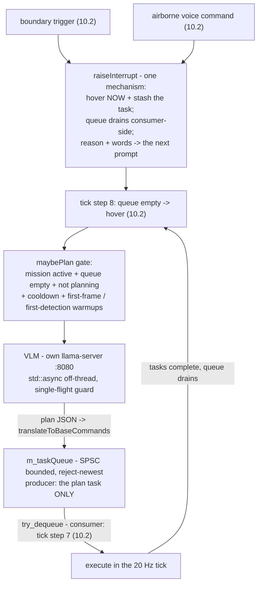
```mermaid
graph TD
    T8b["tick step 8: queue empty -> hover (10.2)"] --> MP["maybePlan gate:<br/>mission active + queue empty + not planning<br/>+ cooldown + first-frame / first-detection warmups"]
    MP --> VLM["VLM - own llama-server :8080<br/>std::async off-thread, single-flight guard"]
    VLM -->|"plan JSON -> translateToBaseCommands"| Q["m_taskQueue - SPSC bounded, reject-newest<br/>producer: the plan task ONLY"]
    Q -->|"try_dequeue - consumer: tick step 7 (10.2)"| EXEC["execute in the 20 Hz tick"]
    EXEC -->|"tasks complete, queue drains"| T8b
    BND["boundary trigger (10.2)"] --> INT["raiseInterrupt - one mechanism:<br/>hover NOW + stash the task;<br/>queue drains consumer-side;<br/>reason + words -> the next prompt"]
    UC["airborne voice command (10.2)"] --> INT
    INT --> T8b
```

### 10.4 Setpoint output — backends to the vehicle

Why 30 Hz: `kOffboardPublishRateHz = 30` (`px4_backend_base.hpp:42`). PX4 accepts an OFFBOARD
switch only after ~1 s of streamed setpoints — 40 warmup setpoints at 30 Hz ≈ 1.33 s — and the
stream must never stop while offboard. The PX4Backend's 30 Hz loop is the ONLY publisher
(`px4_backend.cpp:97`): every tick it publishes the offboard-mode signal plus a
`TrajectorySetpoint` (ENU flipped to NED by the `OffboardTranslator`), then runs the handshake —
arm FIRST, then request OFFBOARD, retried every tick until PX4 reports
`NAVIGATION_STATE_OFFBOARD` (`px4_backend.cpp:106-131`). The messages ride ROS2/XRCE-DDS into
PX4, which drives the motors. Tello instead streams `rc` strings over UDP at 20 Hz
(`kTelloStreamRateHz` — the Tello ingest ceiling). The DJI backend is the deferred third
implementation of the same interface.

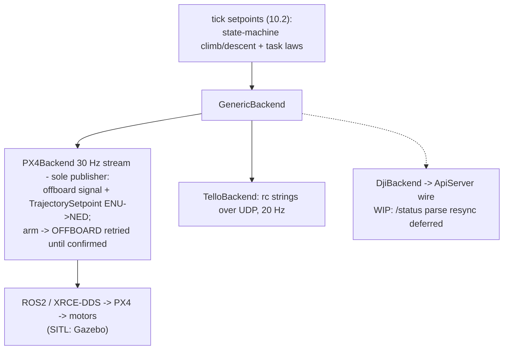
```mermaid
graph TD
    SRC["tick setpoints (10.2):<br/>state-machine climb/descent + task laws"] --> GB["GenericBackend"]
    GB --> PX4["PX4Backend 30 Hz stream - sole publisher:<br/>offboard signal + TrajectorySetpoint ENU->NED;<br/>arm -> OFFBOARD retried until confirmed"]
    PX4 --> MOT["ROS2 / XRCE-DDS -> PX4 -> motors<br/>(SITL: Gazebo)"]
    GB --> TELLO["TelloBackend: rc strings over UDP, 20 Hz"]
    GB -.-> DJI["DjiBackend -> ApiServer wire<br/>WIP: /status parse resync deferred"]
```

Known deliberate hacks (root cause: unreliable metric depth; removal planned post-meeting via
the depth lane): APPROACH anchors a VLM bbox to a world ENU point and flies it by odometry;
ORBIT flies a fixed circle ahead of the drone, not around the true target; auto-land after
APPROACH covered a weak planner — its guard now fires only when the task queue is empty
(applied, compiles; full SITL rerun pending).

---

## 11. A2 live dashboard — CURRENT

**Control flow.** With `FMU_OBSERVABILITY=1` the FMU publishes downscaled 320x240 streams and
JSON strings (with the gate off it publishes nothing — a blank dashboard means the gate is off).
`serve.py` is one `rclpy` node plus one stdlib `ThreadingHTTPServer` (:8088): it subscribes the
topics and re-serves them — the two image topics as MJPEG streams, the HUD/VLM/context/rates
strings as one SSE stream into `dashboard.html` (2x2: annotated camera, depth, flight HUD, VLM
objective + plan + reasoning). Stdlib-only by design: no rosbridge, no foxglove. The bridge
installs its own SIGINT/SIGTERM handlers and joins the spin thread on shutdown — the port-leak
that blocked every second demo run is fixed and verified.

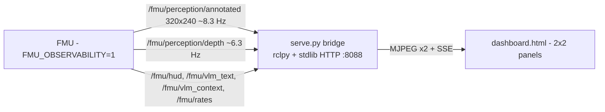
```mermaid
graph LR
    F["FMU - FMU_OBSERVABILITY=1"] -->|"/fmu/perception/annotated 320x240 ~8.3 Hz"| B["serve.py bridge<br/>rclpy + stdlib HTTP :8088"]
    F -->|"/fmu/perception/depth ~6.3 Hz"| B
    F -->|"/fmu/hud, /fmu/vlm_text, /fmu/vlm_context, /fmu/rates"| B
    B -->|"MJPEG x2 + SSE"| PAGE["dashboard.html - 2x2 panels"]
```

Assessor-verified PASS, 9/9 checks, 3 runs (verdict: dashboard logs_20260905_173629/verdict.txt;
the Hz figures above are from that measured verdict).

---

## 12. WIP lanes

| Lane | State | Next gate |
|---|---|---|
| SAM3-nf4 highlighting | WIRED — `SCENE_SEG=sam3` is the default since 2026-09-08; OmDet+SAM2.1 stays as the `omdet` switch | first run on drone video (webcam + mock so far); compound-phrase flicker fix verified live (section 6) |
| integration_harden2 — Gemma 4 single model | CURRENT on webcam + mock (2026-09-08), NOT flown | desk test on drone video, then the flight gate (section 3b) |
| SAM3.1 quantization | tracking peak ~7 GiB is activation-bound; image-detector-only path is angle #1 | dedicated session per its brief |
| Depth SOTA study | study COMPLETE; open fork: Path A depth-anything.cpp ggml (DA3 metric-large q8_0, 176 ms Vulkan) vs Path B Python torch service (DA3-small GPU 38.5 ms) | owner picks post-meeting; then the FMU depth hacks go |
| DjiBackend /status resync | deferred; dji_backend does not POST /c/fly, unaffected today | at llm_to_action-to-DJI integration time |
| llm_to_action presentability | README + demo polish + 4B swap + auto-land guard done | full multi-step VLM mission in Gazebo (owner runs) |
| Full-chain overlay | implemented in scene_omdet | needs one app restart; not yet seen live |

---

## 13. Resource budget and verification gates

GPU: RTX 5070 Laptop, 8,151 MiB. Measured figures: the census
(`tools/bench/model-cpu-or-gpu/README.md`, census.py, 2026-09-02 — nvidia-smi after load plus
one real inference, co-resident stack).

| Model (the deployed harden stack, all co-resident) | VRAM | Source |
|---|---|---|
| Qwen3-VL-4B Q4 + mmproj | 3,821 MiB | sam3-stack census 2026-09-07, measured |
| Hy-MT2-1.8B Q4 (translator, GPU) | 1,187 MiB | same, measured |
| whisper-large-v3-turbo q5_k (ASR) | 827 MiB | same, measured — supersedes the ~550 MiB file-size estimate |
| SAM3-nf4 (perception2, in-process) | 1,074 MiB | same, measured (886 MiB isolated peak; in-process is the real number) |
| YOLO background detector | 282 MiB | same, measured |
| image-encode transient | 94 MiB | same, measured |
| **Total used** | **7,396 of 8,151 MiB — 313 MiB free** | `census.py --sam3-stack`, `tools/bench/model-cpu-or-gpu/results/2026-09-07-sam3-stack-census.json` |

Why these defaults fit and the old pair did not: OmDet-Turbo (863) + SAM2.1 (728) left no room for
a GPU translator — even Hy-MT2 Q4 was 110 MiB over. SAM3 unifies both and saves ~705 MiB; that
saving is what lets the translator move from CPU (DictaLM, p50 199 ms) to the GPU. It fits at Q4
only; Q6 (+326 MiB) would overrun (campaign: docs/active/2026-09-07-vram-perception-campaign-results.md §4).
DictaLM on CPU remains the `MVD_TRANSLATOR=dicta` fallback, zero VRAM.

| Gate | Result |
|---|---|
| integration_harden wiring tests | 32 passed |
| Recognizer + perception self-tests | clean |
| hebrew-command-bench --audit | CLEAN |
| live_mock_smoke (4 tiers over real HTTP) | PASSED |
| Desk test (Hebrew mic -> missions on the wire) | verified live 2026-09-05 |
| SITL follow scenario + dashboard assessor | PASS, 9/9 checks, 3 runs |
