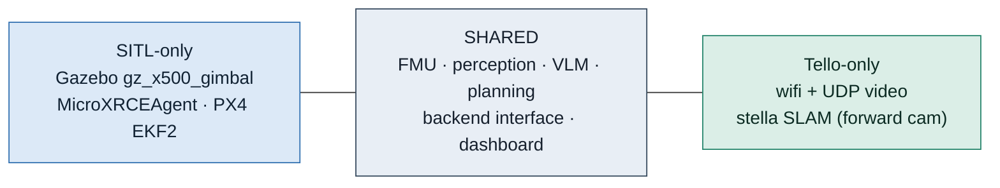
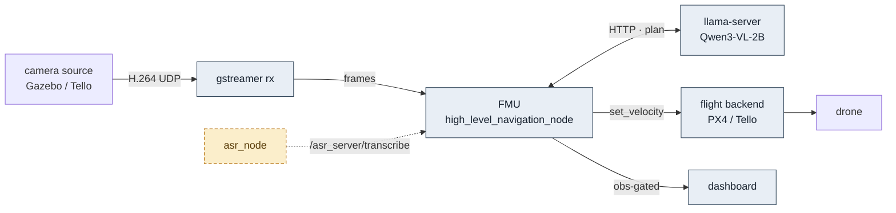
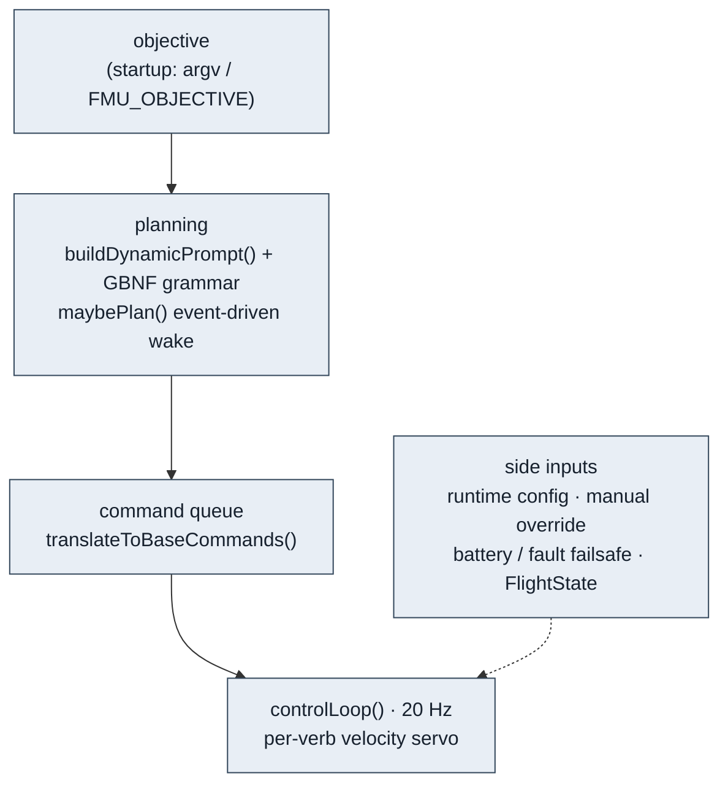
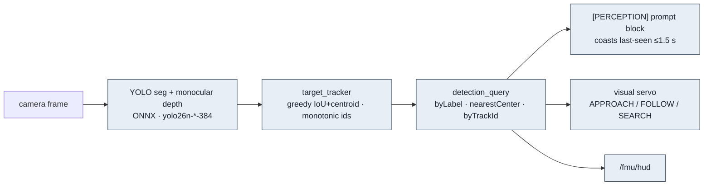
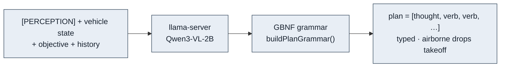
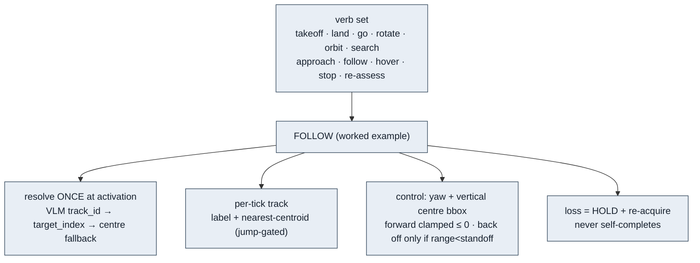
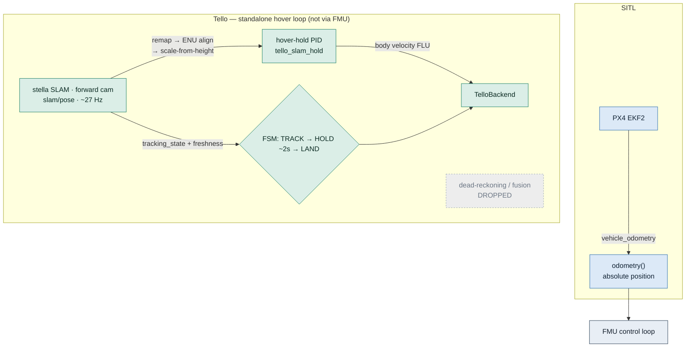
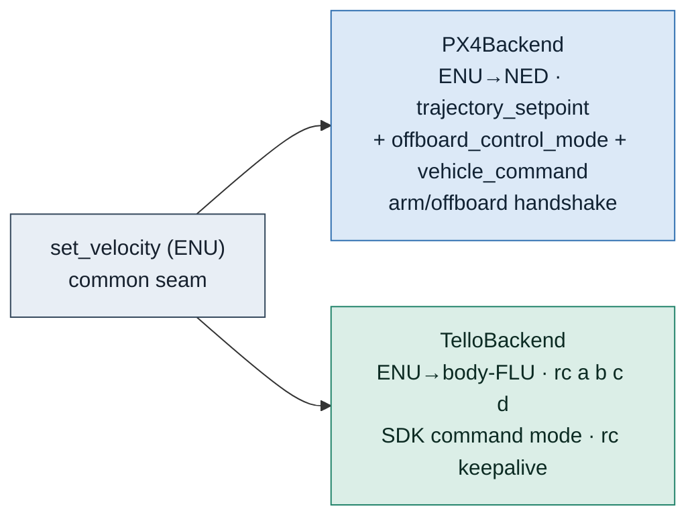
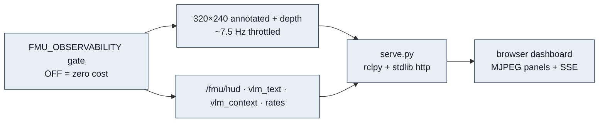
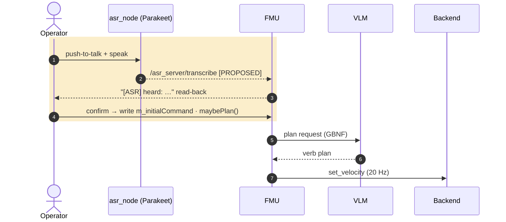

# Groundstation — Architecture Deck (12 slides)

Presentation build of the system architecture. One plane per slide so each diagram stays projector-
legible without losing rigour. Render in the VS Code Markdown preview (mermaid). Each slide below has a
**visual**, **key points** (say these), and **notes** (know these). Colour key is shared across all
diagrams: grey = shared, blue = SITL-only, green = Tello-only, amber dashed = proposed (ASR).

Facts verified against source by the FOLLOW and SLAM sessions. Drawn as the target system with voice assumed complete.

---

## Slide 1 — Thesis

# VLM plans, deterministic math flies.

Off-board control for a camera drone. A vision-language model reads an objective and a live frame and
emits a **verb plan**; a 20 Hz control loop turns verbs into velocity. The model never touches the
motors — it chooses *what*, the deterministic servo decides *how*.

**Key points**
- One codebase, two targets: PX4/Gazebo (SITL) and a physical DJI Tello.
- The model is advisory; safety and control are deterministic and testable.

**Notes:** lead with the split of responsibility — that is the whole design philosophy and it is what
makes an unreliable model safe to fly behind.

---

## Slide 2 — Two targets, one codebase

**Visual**

**Key points**
- ~80% of the stack is shared. The targets differ in exactly two places: the **camera source** and
  **localization** (how the drone knows where it is).
- Colour key for the whole deck: grey shared, blue SITL, green Tello, amber = proposed voice.

**Notes:** planting the colour key here means every later slide is readable at a glance.

---

## Slide 3 — System at a glance (the spine)

**Visual** — top-level processes only; detail deferred to later slides.

**Key points**
- The FMU is the hub: it fuses perception, calls the VLM for a plan, streams velocity to the backend.
- `set_velocity` is the common seam — everything target-specific is on the far side of it.

**Notes:** this is the map. Tell the audience the next slides zoom into each box; don't read topics yet.

---

## Slide 4 — Inside the FMU

**Visual**

**Key points**
- Two clocks: an **event-driven** planner (wakes on new perception/objective) and a **fixed 20 Hz**
  control loop. The model runs slow; control never stalls.
- Failsafes, manual override, and FlightState gate the loop independently of the model.

**Notes:** the two-clock design is why a 9–27 s VLM latency doesn't crash the aircraft.

---

## Slide 5 — Perception plane

**Visual**

**Key points**
- Segmentation + depth → a **stable-id tracker** so verbs can lock one target across frames.
- The prompt block **coasts** a blank frame (feeds last-seen for 1.5 s) so seg flicker never tells the
  VLM "no detections."

**Notes:** the coasting detail matters — without it the model re-plans on every dropped frame.

---

## Slide 6 — Planning: constraining the model

**Visual**

**Key points**
- The plan is **grammar-constrained at decode** (GBNF), not just prompted — the model *cannot* emit a
  malformed plan or take off twice.
- json-schema `const` was proven not enforced by this build; raw GBNF is.

**Notes:** this is the reliability lever. The grammar is what lets a 2B model drive safely.

---

## Slide 7 — Verbs & the FOLLOW servo

**Visual**

**Key points**
- FOLLOW is position-free and yaw-only — it works on the Tello with no XY.
- It **never advances** (forward clamped ≤ 0); `standoff` is a *minimum safe distance*, not a target.

**Notes:** use FOLLOW as the concrete verb; the others share this servo substrate.

---

## Slide 8 — Localization: the deep split

**Visual**

**Key points**
- SITL gets **absolute** position from EKF2 — the FOLLOW headline runs here with real position, no SLAM.
- The Tello has **no absolute XY from hardware**; SLAM off the **forward** camera is the only source, and
  only while that scene is textured.
- **No dead-reckoning** — `vgx/vgy` read a false zero when the VPS is blind, so it was dropped. Loss =
  bounded hold (~2 s) → vertical land; it never traverses blind.
- Two surfaces required: forward scene (SLAM) and floor (VPS). Either blinded by glass/smooth concrete.
- The hover loop is a **standalone node**, not yet wired into the FMU.

**Notes:** highest-rigour slide. The surface precondition and the "no DR, hold-then-land" behaviour are
the Tello demo's real gating facts — do not overclaim autonomy here.

## Slide 9 — Control / actuation

**Visual**

**Key points**
- One velocity command in ENU; each backend owns the frame transform and the vehicle protocol.
- Swapping targets swaps the backend — nothing above `set_velocity` changes.

**Notes:** `kTelloMaxSpeedMps` is still an uncalibrated estimate scaling every Tello command — flag it
as known debt.

---

## Slide 10 — Observability (zero-cost when off)

**Visual**

**Key points**
- Everything is behind one gate; OFF is genuinely zero-cost (protects takeoff latency).
- Lean transport: FMU downscales to 320×240 before publishing — the earlier full-frame version starved
  the VLM.

**Notes:** this is the demo's "what is it seeing/thinking" screen.

---

## Slide 11 — Voice control (proposed) + the runtime sequence

**Visual**

**Key points**
- ASR node exists and publishes transcripts; the **only** missing wiring is one FMU subscription
  (objective enters at startup today).
- Safety net is **operator read-back**, not a confidence gate — the confidence score was tested and
  does not track correctness. Noise filtering was tested too: net-negative, raw audio ships.

**Notes:** be honest that this edge is proposed; the rest of the sequence is live.

---

## Slide 12 — Status: landed vs proposed

| Component | State |
|---|---|
| FMU planning + 20 Hz control + GBNF grammar | landed |
| Perception (seg + depth + stable-id tracker) | landed |
| Verbs incl. FOLLOW, HOVER, SEARCH-by-tag | landed (FOLLOW tuning in progress) |
| Backends (PX4 + Tello) + dashboard | landed |
| Tello camera calibration | landed (RMS 0.438) |
| stella SLAM bring-up (forward cam) | landed (~27 Hz, real Tello) |
| Tello hover-hold node + recovery FSM | built, in hardware bring-up (dead-reckoning dropped) |
| ASR node | built; **integration into FMU proposed** (one subscription) |

**Key points**
- The reliable headline is the SITL hat-follow demo (needs no SLAM).
- The Tello + SLAM path is the stretch; ASR integration is a ~1-hour wiring task.

**Notes:** end on what is demo-ready today vs what is stretch, so expectations match the live run.

---

_12 slides · target system · ASR assumed complete · 2026-08-12. Merge or split slides 6–7 (planning +
verbs) or 9–10 (control + observability) if you need a shorter cut; slide 8 (localization) should stay
whole — it carries the most rigour._
